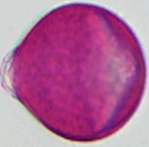

# *Trifolium repens* / *Melilotus* / *Aesculus*

Pollen die op elkaar lijken in honingpreparaten.

| Taxon | Nederlands |
| :--- | :--- |
| *Trifolium repens* | witte klaver |
| *Melilotus* | honingklaver |
| *Aesculus* | paardenkastanje |

## Overeenkomsten

- Belangrijk lookalike-cluster in Nederlandse honingpreparaten.
- Scheiding alleen betrouwbaar op combinatie van grootte, colpusvorm en netwerkstructuur.

## Verschillen

- *Melilotus*: in praktijk vaak kleiner en hoekiger dan *Trifolium repens*.
- *Trifolium repens*: gering driehoekig; fijn reticulaat; ca. 21–25 µm.
- *Aesculus*: meenemen in dezelfde vergelijkingsrij bij twijfel.

## Verschrompelde of abortieve korrels

Vooral bij *Rubus*, *Trifolium repens* en veel tuincultivars kunnen verschrompelde korrels de meerderheid vormen (zwellen niet bij montage).

  

    <figure class="pid-scale-item">
      
      <figcaption>*T. repens*</figcaption>
    </figure>
  

## Drachtplantgegevens (Imkerpedia)

- Latijnse naam: *Trifolium repens*
- Nederlandse naam (Imkerpedia): Witte klaver
- Voorkomen: vast
- Stuifmeelkleur: Bruinachtig
- Nectarwaarde: N 5
- Pollenwaarde: P 5
- SB: 5
- EB: 10
- Bron: [Imkerpedia - Drachtplanten](https://www.imkerpedia.nl/wiki/index.php/Drachtplanten)
