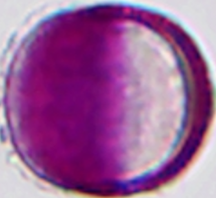
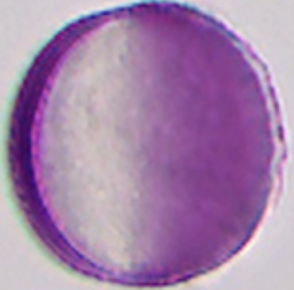
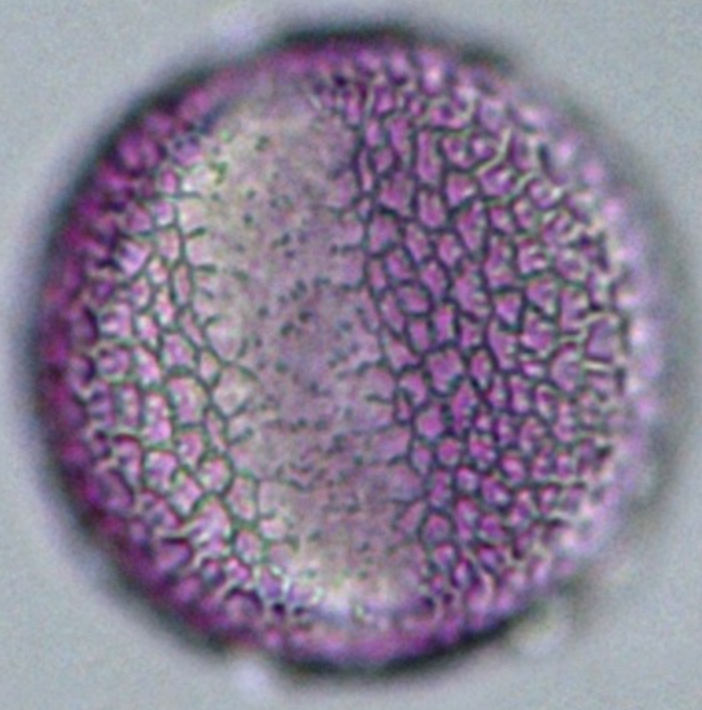
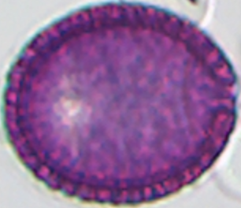

# *Raphanus* / *Brassica napus* / *Sinapis* / *Ligustrum*

Pollen die op elkaar lijken in honingpreparaten.

| Taxon | Nederlands |
| :--- | :--- |
| *Raphanus* | bladramenas / radijs-type |
| *Brassica napus* | koolzaad |
| *Sinapis* | mosterd / herik |
| *Ligustrum* | liguster |

## Overeenkomsten

- tricolpaat tot tricolporaat
- reticulaat oppervlak
- klein tot middelgroot

## Verschillen

- *Brassica napus*: rond, sferoïd tot licht prolaat; reticulaat; ca. 22–28 µm.
- *Ligustrum*: sferoïd tot licht oblaat; reticulaat; ca. 24–34 µm; apertuurmembranen zonder ornamentatie.
- *Raphanus*-type en *Sinapis*-type: meenemen in dezelfde vergelijkingsrij (Cruciferae / Brassicaceae vs. Oleaceae).

  

    <figure class="pid-scale-item">
      
      <figcaption><em>Raphanus</em></figcaption>
    </figure>
    <figure class="pid-scale-item">
      
      <figcaption><em>B. napus</em></figcaption>
    </figure>
    <figure class="pid-scale-item">
      
      <figcaption><em>Sinapis</em></figcaption>
    </figure>
    <figure class="pid-scale-item">
      
      <figcaption><em>Ligustrum</em></figcaption>
    </figure>
  

