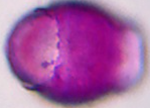
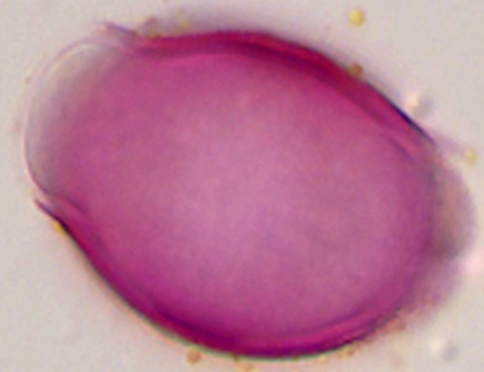

# Rubus / *Prunus serotina* / *P. padus*

Pollen die op elkaar lijken in honingpreparaten.

| Taxon | Nederlands |
| :--- | :--- |
| *Rubus* | braam, framboos |
| *Prunus serotina* | Amerikaanse vogelkers |
| *Prunus padus* | vogelkers |

## Overeenkomsten

- tricolporaat
- klein tot middelgroot
- glad tot zwak striaat oppervlak

## Praktische determinatie

- Vergelijk pool- en equatoriaal aanzicht naast elkaar.
- *Rubus*-type: vaak driehoekig in poolaanzicht; glad/striaat.
- Vogelkers (*P. padus* / *P. serotina*): rond tot driekantig, afhankelijk van ligging.

  

    <figure class="pid-scale-item">
      
      <figcaption><em>Rubus</em></figcaption>
    </figure>
    <figure class="pid-scale-item">
      
      <figcaption><em>P. padus</em></figcaption>
    </figure>
  

