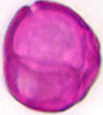
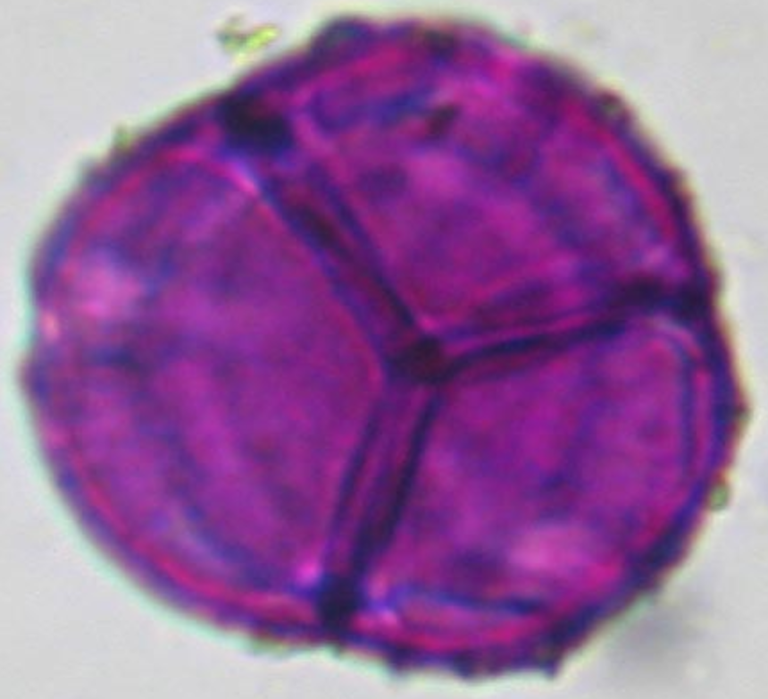
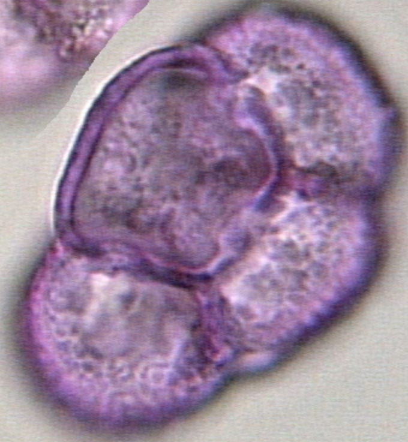
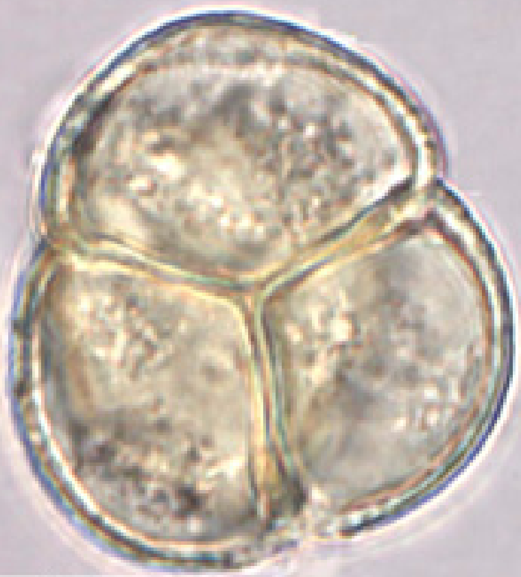
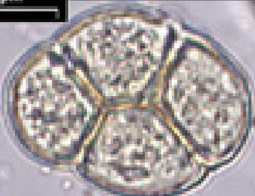
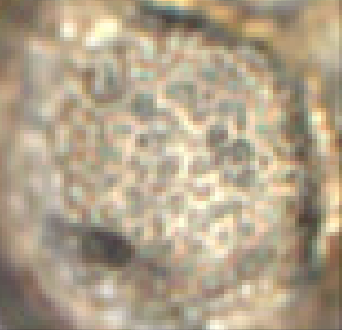
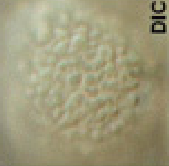
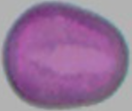
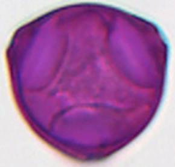

# Heidehoning (Calluna vulgaris (struikheide) - Ericaceae)

  

      <figure class="pid-scale-item">
      
      <figcaption class="pid-scale-caption">Calluna vulgaris (50 µm)</figcaption>
    </figure>
      <figure class="pid-scale-item">
      
      <figcaption class="pid-scale-caption">Calluna vulgaris (50 µm)</figcaption>
    </figure>
    <figure class="pid-scale-item">
      
      <figcaption class="pid-scale-caption">Calluna vulgaris (50 µm)</figcaption>
    </figure>
    <figure class="pid-scale-item">
      
      <figcaption class="pid-scale-caption">Calluna vulgaris (50 µm)</figcaption>
    </figure>
 

## Calluna vulgaris (struikhei)
- tetrade van 51 µm 
- kristalgruis

## Herkenning hoofdpollen
- alle gebruikelijk heidepollen zijn tetraden. 

### Vorm, afmeting en apertuur

| Kenmerk | Waarde |
| --- | --- |
| **Pollenunitgrootte** | 	26-50 µm |
| **Pollengrootte** |  size of hydrated pollen (LM): 	27 (22.5-30.0) μm (Medium) |
| **Vorm** | tetradeae, rond tonvormig, onregelmatig bij ongehydrateerde pollen |
| **Aperturen** | korte brede colpi, tricolpaat of tricolporaat |
| **Polariteit** | heteropolair  |
| **P/E-ratio** | - |

### Ornamentatie en structuur

| Kenmerk | Waarde |
| --- | --- |
| **Ornamentatie** | psylaat (pollenwiki), verrucate, scabrate, gemmate (paldat en Beug) |

### Afbeeldingen

  

      <figure class="pid-scale-item">
      
      <figcaption class="pid-scale-caption">Calluna vulgaris</figcaption>
    </figure>
      <figure class="pid-scale-item">
      
      <figcaption class="pid-scale-caption">Calluna vulgaris</figcaption>
    </figure>
    <figure class="pid-scale-item">
      
      <figcaption class="pid-scale-caption">Calluna vulgaris</figcaption>
    </figure>
    <figure class="pid-scale-item">
      
      <figcaption class="pid-scale-caption">Calluna vulgaris</figcaption>
    </figure>
  

  

    <figure class="pid-scale-item">
      
      <figcaption class="pid-scale-caption">Calluna vulgaris</figcaption>
    </figure>
    <figure class="pid-scale-item">
      
      <figcaption class="pid-scale-caption">Calluna vulgaris</figcaption>
    </figure>
    <figure class="pid-scale-item">
      
      <figcaption class="pid-scale-caption">Calluna vulgaris</figcaption>
    </figure>
    <figure class="pid-scale-item">
      
      <figcaption class="pid-scale-caption">Calluna vulgaris</figcaption>
    </figure>
  

  <!-- Grijswaarde maatreferentie (vaste set; klein → groot). -->
  

    <figure class="pid-scale-item">
      
      <figcaption class="pid-scale-caption">Echium (17 µm)</figcaption>
    </figure>
    <figure class="pid-scale-item">
      
      <figcaption class="pid-scale-caption">Corylus (26 µm)</figcaption>
    </figure>
    <figure class="pid-scale-item">
      
      <figcaption class="pid-scale-caption">Brassica (26 µm)</figcaption>
    </figure>
    <figure class="pid-scale-item">
      
      <figcaption class="pid-scale-caption">Cichorium (40 µm)</figcaption>
    </figure>
  

### Externe determinatiebronnen
- [PollenX](https://pollenx.eu/species.php?species=Calluna_vulgaris)
- [Pollen-Wiki](https://pollen.tstebler.ch/MediaWiki/index.php?title=Calluna_vulgaris)
- [PalDat](https://www.paldat.org/pub/Calluna_vulgaris/304299)

## Pollen die erop lijken
### Heidefamilie. 
- Alle gangbare voorbeelden zijn tetraden.
- Elke korrel heeft drie groeven, aan één uiteinde puntig en aan het andere afgekapt waar hij de contactlijn met de buurkorrel raakt.
-  Daar sluit hij aan op de overeenkomstige groef van de buur en vormt een samengestelde groef.
- Op elke groef bevind zich meestal net buiten de contactlijn een porie, vaak lastig te zien.
    - Calluna (struikheide), onregelmatige tetraden, poriën opvallend (30-50 μm)
    -  Rhododendron, regelmatige tetraden (50 μm). 
    - Vaccinium (bosbes) en Erica-soorten (heide) regelmatige tetraden, alleen in detail verschillend (30-45 μm). 
    - Empetrum (kraaiheide) van Empetraceae: pollen als de vorige groep maar met dwarsgroeven in plaats van poriën (30 μm). 
    - Euphorbiaceae (wolfsmelkfamilie) Oppervlak met fijne staven, korrelig

#### Andere tetraden 
- Onagraceae (teunisbloemfamilie)
- Sommige Typha (lisdodde soorten)

## Relevante neven- en bijpollen
- Trifolium repens (witte klaver)
- Erica tetralix gewone dopheide
- Fagopyrum (boekweit)

## Melissopalynologische interpretatie
- Calluna vulgaris (struikheide) komt in 22% van de Nederlandse honing voor
- Erica tetralix (gewone dophei) komt in 8% van de Nederlandse honing voor
- Heidehoning bevat colloidale eiwitten en dit veroorzaakt het fysiologisch fenomeen thixotropie (gelachtige consistentie)
- Kan gewonnen worden door zgn honingwals/honinglosser/ericaborstel of persen, dan dus tertiaire inbreng hebben in het laatste geval
- Mag maximaal 23% vocht bevatten en bakkershoning van struikheide ten hoogste 25% (itt 20% voor normale honing) (bron: cursusboek honingkunde)
  - Snelle toename van HMF
  - Hoge zuurgraad
  - Kortere houdbaarheid

### Aandeel in de monoflorale honing

- **Representatiegroep:** Groep II-III soms IV ( pollenkorrels per 10 gram). 
  - minimale pollen aandeel 30-45% (cursusboek honingkunde)
  - verzamelde pollen komen door ericaborstel of door persen in de honing terecht waardoor percentage Calluna pollen wordt verlaagd. 

### Pollengehaltes ("pollengehaltes")
| Bron | Absolute pollengehaltes (per 10 g) |
| --- | ---: |
| Persano Oddo | calluna 10-77% (soms ondervertegenwoordigd)|
| Persano Oddo | erica meer dan 45% (normaal vertegenwoordigd)|
| Demianowics | - |
| IHC (Europese honing) | - |
| Sawyer | - |

## Palynologische betekenis

## Sleutels
### **Beug:** (EPK = individuele pollenkorrel)
- Niet 1: EPK niet reticulat–areolat (tabel 1: 1–2), ca. 60–80 µm (niet 4.1 Catalpa).
- TODO Niet 2: EPK niet „echinat” in de zin van tabel 2: 1–2 (de exact tegenhanger van andere stellingen staat in het volledige boek; in dit fragment niet volledig uitgewerkt).
- 3: „EPK met poriën en/of colpi …” (meestal tricolpat, monoporaat of triporaat)
- 4: Tetraden coaperturat (afb. 2a,b) 
- 5: EPK colpat 
- 7: EPK verrucat, scabrat of psilat en tricolpat (evt. tricolporat of tetracolpat); tetraden meestal <60 µm, zelden tot ca. 75 µm”

 → 4.7 Ericaceae–Empetrum-groep.

Stelling 1 — tweede optie: EPK niet of slechts zeer zwak onderling afgezet: in optische doorsnede zijn de tetraden nagenoeg cirkelrond of enigszins driehoekig, zonder duidelijke insnijdingen waar de EPK elkaar raken. (Dus niet de eerste optie: duidelijke insnijdingen / sterke “afzetting” tegenover elkaar.)

Stelling 2 — tweede optie: Binnenwanden van de tetraden niet of ** nauwelijks** dicht perforated — dus niet de tak “binnenwanden dicht geperforeerd” die naar Arctostaphylos alpina leidt (4.7.1 in uw bron).

Stelling 3 — eerste optie vermijden: Niet “skulptur scabrat, binnenwanden van de tetraden slechts met enkele perforaties” → 4.7.2 Arctostaphylos uva-ursi.

Arbutus-tak vermijden: Niet “skulptur psilat, binnenwanden niet geperforeerd” → Arbutus unedo (in uw fragment staat de 4.7.x-nummers bij soorten wat door elkaar; Arbutus hoort functioneel vóór Calluna in de uitstoot van deze sub-sleutel).

Stelling 4 — kies deze optie voor Calluna: EPK in de meeste gevallen met 4 korte, brede colpi. Tetraden altijd onregelmatig gevormd; sculptuur grof scabrat tot verrucat; EPK soms in één vlak of één rij (tabel 1: 7 en 10) → 4.7.4 Calluna vulgaris (L.) Hull — ca. 34,0–48,0 µm, MiW 39,4 µm; 50 PK, 0a (zoals in uw tekst).

### **van der Ham**
1. vier pollenkorrels bij elkaar (tetrade)
2. individuele korrels stevig verbonden, tricolpaat of tricolporaal --> Ericacea (Calluna, Erica, Rhododendron, Vaccinium)
### **Sawyer**
Size: medium
Shape: veelvormig of irregulair
Apertuuraantal: 3
Apertuur type: colporaat
Oppervlak: glad of ongedefineerd (granulair)
Exine: dun / gemiddeld zonder rods
Overig: samengestelde korrels

## Botanische achtergrond
- Calluna heeft per bloem slechts 4400 pollen
- nectarium als schijf gelegen rond de basis van de vruchtbladen

### Taxonomie:

- [Verspreidingskaart (waarneming.nl)](https://waarneming.nl/species/6509/maps/?start_date=2020-01-01&interval=15552000&end_date=2030-01-01&map_type=grid10k)

**Nectar- en pollenwaarde + (start/einde) bloeitijd**: [bron: imkerpedia]

| Soort   | Nectar | Pollen | Start | Einde |
|---------|--------|--------|-------|-------|
| Calluna | 5      | 5      | 7     | 9     |

## Naslag
- [Main European unifloral honeys: descriptive sheets, Oddo et al, 2004](https://www.apidologie.org/articles/apido/pdf/2004/06/MHS06.pdf)

