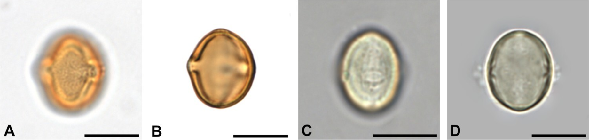
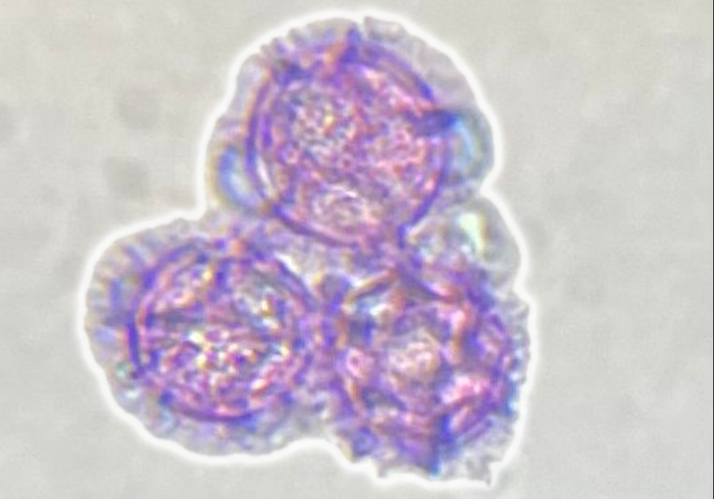
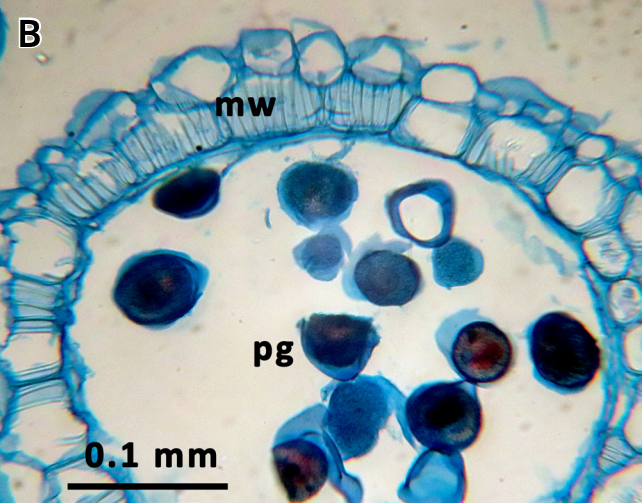
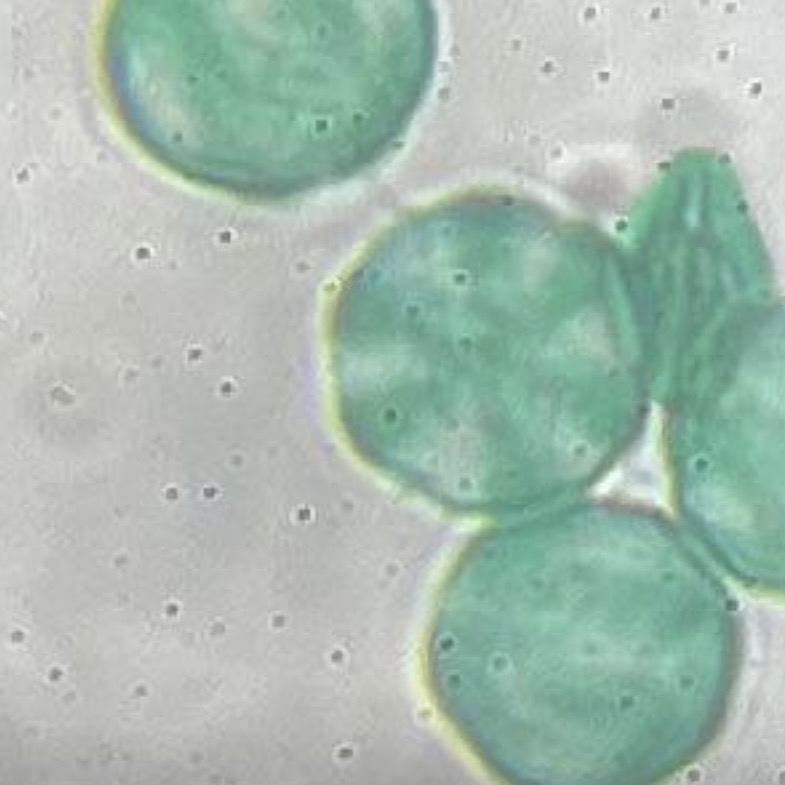
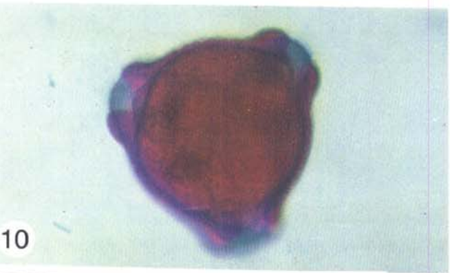
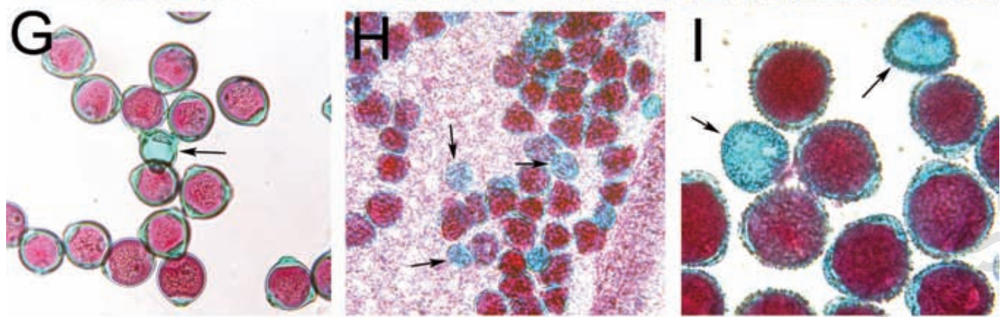
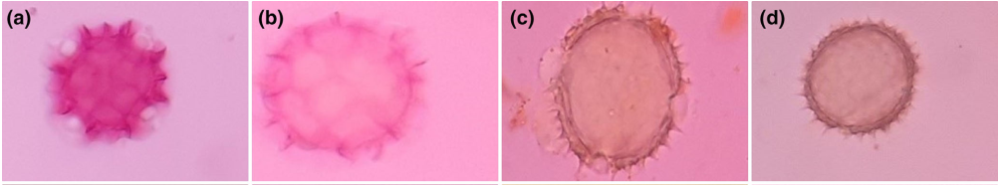

# Vergelijking pollen kleurprotocollen voor lichtmicroscopie

**Scope:** 
- water- en/of alcohol gebaseerde kleuringen toegepast voor insluiten
**Excluderen:**
- kleuringen geintegreerd in insluitmiddel (gelatine-glycerine)
- acetolyse (beste, echter zuurkast (=afzuiging= hood w laminary flow) nodig)

- Koelzer, K., Ribarits, A., & Weber, M. (2024). Comparing the acetolysed and hydrated methods for the pollen analysis of honey. *Grana*. [doi:10.1080/00173134.2024.2348651](https://doi.org/10.1080/00173134.2024.2348651)
- overige fixaties en kleuringen waarvoor zuurkast nodig is
- fluorescente kleuringen
- SEM en TEM

## Geteste kleuringen

1. **Basische fuchsine:** veel gebruikt (geïntegreerd in gelatine-glycerine insluitmiddel of kleuring voor insluiten)
2. **Safranin O + Astra Blue:** ([Novikov](https://www.researchgate.net/publication/352463294_Modified_staining_protocol_with_Safranin_O_and_Astra_Blue_for_the_plant_histology#fullTextFileContent))
  - Eerste test:
    
  - Novikov afbeelding:
    
 (Novikov et al. 2021).
 - Novikov, A., et al. (2021). Modified staining protocol with Safranin O and Astra Blue for the plant histology. *Plant Introduct*. [doi:10.46341/pi2021005](https://doi.org/10.46341/pi2021005)
3. **Chrysoidine (oranje) en malachiet (groen):**
2026-07-11
  

## nog te testen
Doel: beste zichtbaarheid van structuur, ornamentatie, colpi en pori.

1. **Astra Blue en Basische Fuchsine:** [Kraus](https://www.researchgate.net/publication/52001296_Astra_Blue_and_Basic_Fuchsin_Double_Staining_of_Plant_Materials)
  Deze sluiten in Kaizers in met daarin 0,5% astra blue en 1% basische fuchsine.  
   
2. **Malachiet green - Acid Fuchsin - Orange G**
   
- Alexander, M. P. (1969). Differential staining of aborted and nonaborted pollen. *Stain Technology*. [doi:10.3109/10520296909063335](https://doi.org/10.3109/10520296909063335)

- **Safranin + Alcian Blue:** optimized for plant reproductive structures because some stains otherwise became pale or washed out during processing; reported suitable for sunflower structures (Babro et al. 2023).
- **Astra blue + Basic fuchsin:** double stain for pollen preparations from temporary to permanent mounts (Kraus et al. 1998).
- Kraus, J. E., et al. (1998). Astra blue and basic fuchsin double staining of plant materials. *Biotechnic & Histochemistry*. [doi:10.3109/10520299809141117](https://doi.org/10.3109/10520299809141117)

## niet testen

In de foto's in het artikel onvoldoende details aangekleurd 
- Nunes, A. R. S., et al. (2024). Melissopalynological methodologies for investigating honey samples: a critical approach. *Anais da Academia Brasileira de Ciencias*. [doi:10.1590/0001-3765202420230703](https://doi.org/10.1590/0001-3765202420230703)

- Hayat, K., et al. (2023). Pollen morphological investigation of selected species of family Asteraceae from Pakistan by using light and scanning electron microscopy. *Microscopy Research and Technique*.
Ali 2021 zit achter betaalmuur

### cytologische kleuringen

Deze kleuringen meten **levensvatbaarheid**, niet exinemorfologie. Ze vallen buiten de hoofdscope (morphologie voor identificatie), maar staan hier ter vergelijking.

**Bron:** Skrzypkowski et al. (2023), vergelijkende studie naar LM-viabiliteitsprotocollen.

**Werkwijze (alle kleuringen):** anthers uit knoppen of bloemen, macereren in een druppel kleurstof, dekglas, 10 min (of 24 h bij MTT/TTC/aniline blue) in het donker, brightfield of fluorescentie. Minimaal 100 cellen per preparaat.

| Kleuring | Werkoplossing | Incubatie | Levende cel | Dode cel |
|---|---|---|---|---|
| Acetokarmijn | 2% (w/v): 10 g karmijn in 225 mL ijskoud azijnzuur + 275 mL water, gekookt 30 min, gefilterd | 10 min, RT, donker | roze tot rood | kleurloos |
| Aceto-orceïne | 1 g orceïne in 22,5 mL azijnzuur + 27,5 mL water (heet azijnzuur over poeder) | 10 min, RT, donker | donkerroze | kleurloos |
| Alexander | 10 mL 95% ethanol, 10 mg malachietgroen, 50 mL water, 25 mL glycerol, 5 g fenol, 5 g chloralhydraat, 50 mg zuurfuchsine, 5 mg Orange G, 2 mL azijnzuur | 10 min, RT, donker | roze tot donkerpaars | inhoud kleurloos; wand groen/blauw |
| Anilineblauw in lactofenol | kant-en-klaar: 50 mg anilineblauw, 25 g fenol, 25 g melkzuur, 50 g glycerol per 100 mL | 24 h, RT, donker | blauw | kleurloos |
| Calceïne-AM | stock 1 mg/mL in DMSO; werk: 1 µL stock per 1 mL medium | 10 min, RT, donker | geel-groene fluorescentie (495/515 nm) | geen fluorescentie |
| FDA | stock 0,5% (w/v) in aceton; verdunnen in medium | 10 min, RT, donker | geel-groene fluorescentie (485/515 nm) | niet fluorescent |
| Lugol | kant-en-klaar jodiumoplossing | direct | donkerbruin tot zwart (zetmeel) | geel tot lichtbruin |
| MTT | 1% (w/v) in 5% sucrose-water | 24 h, RT, donker | donkerroze tot paars | kleurloos |
| TTC | 1% (w/v) in sucrose-water (12 g/20 mL) | 24 h, RT, donker | roze tot rood | kleurloos |

## In vitro pollenkieming

Gerelateerd aan viabiliteit, niet aan taxonomische identificatie. Pollen op vaste kiemmedium-druppel, 24 h bij 26 °C in vochtige kamer, fasecontrast.

| Medium | Samenstelling |
|---|---|
| 5% sucrose | 5% (w/v) sucrose in water |
| 10% sucrose | 10% (w/v) sucrose in water |
| BK-medium | Ca(NO₃)₂·4H₂O, MgSO₄·7H₂O, KNO₃, H₃BO₃ + 10% sucrose |
| G-medium | 5 mg/dm³ H₃BO₃ + 5% sucrose (Gaaliche et al.) |

Alle media: 1% agar. Kieming = pollenbuis langer dan korrel diameter. Minimaal 300 korrels per medium.

## Toluidine blue (morphologie, nog te testen)

0,1 g toluidine blue in 100 mL 2,5% natriumcarbonaat (Na₂CO₃); bewaren bij +4 °C. Palynologie-referentie: [Methods in Palynology](https://link.springer.com/content/pdf/10.1007/978-3-319-71365-6_6.pdf).

## Contrastvergelijking (exinemorfologie)

LM verbetert wandcontrast maar haalt SEM-niveau voor fijne sculptuur niet. Kleurkeuze helpt zichtbaarheid meer dan resolutie (Pospiech et al. 2021; Javed et al. 2024; Amina et al. 2020).

| Kleuring | Beste inzet | Sterke punten | Beperkingen | Oordeel |
|---|---|---|---|---|
| Basische fuchsine | Exinesculptuur, aperturen, routine | Donkere wandkleuring; meer oppervlakdetail in gehydrateerd LM | Fijne sculptuur LM-beperkt; kan vervagen | Best overall (Koelzer et al. 2024) |
| Alcian blue | Sediment scheiden in honing | Betere korrelscheiding; minder conglomeraten | Meer scheiding dan wanddetail | Best adjunct (Nunes et al. 2024) |
| Safranin O | Algemene morphologie, metingen | Exinedikte, aperturen, grootte | Geen bewijs voor beter contrast vs. fuchsine | Acceptabel (Kostryco et al. 2020; Hayat et al. 2023) |
| Astra blue | Differentiële wandkleuring | Bekend in histologie-dubbelkleuring | Weinig directe LM-pollenvergelijkingen | Niet top-tier (Weber et al. 2010) |
| Malachietgroen | Traditioneel kandidaat | Onderdeel Alexander | Geen standalone exine-bewijs | Niet als primaire exinekleuring |
| Chrysoidine | Differentiële kleur (oranje) | Combinatie met malachietgroen getest | Weinig literatuur voor exine | In test (eigen lab) |

Basische fuchsine scoort het hoogst voor gehydrateerde melissopalynologie (Koelzer et al. 2024; Jia et al. 2021).

## Workflow

**Gehydrateerd honingsediment:** meer pollentypes, minder wasstappen dan acetolyse (Koelzer et al. 2024). Vuil sediment: water, dan 96% ethanol, dan 90% ethanol vóór kleuring (Nunes et al. 2024).

**Hars / permanente preparaten:** Novikov Safranin O + Astra Blue: sequentiële kleuring, ethanol, dehydratatie, xyleen; geschikt voor hars, niet voor gelatine (Novikov et al. 2021).

**Computer vision:** kleur en morfologie zijn discriminant; consistente intensiteit en lage achtergrond zijn cruciaal (Pospiech et al. 2021; Litwińczyk et al. 2026).

**Best practice (beperkt bewijs):** geen sterk gevalideerd recept voor standalone pre-hars kleuring met fuchsine, safranin of malachietgroen. Houd sediment schoon en gehydrateerd; documenteer meerdere focusvlakken; kleuring is contrast, geen resolutievervanger.

## Protocollenoverzicht

| Protocol | Hoofddoel | Oplosmiddel / formaat | Opmerking |
|---|---|---|---|
| Basische fuchsine | Honing-morphologie | Kleurstof in LM-preparaat | Snel, goedkoop (Nunes et al. 2024) |
| Alcian blue | Honing-morphologie | Kleurstof in LM-preparaat | Betere scheiding (Nunes et al. 2024) |
| Safranin O + Astra blue | Differentiële wand | 1% elk in 70% ethanol | Hars-compatibel (Novikov et al. 2021) |
| Safranin + Alcian blue | Reproductieve structuren | Differentiële kleuring | Zonnebloem LM (Babro et al. 2023) |
| Astra blue + basische fuchsine | Pollenpreparaten | Dubbelkleuring | Tijdelijk tot permanent (Kraus et al. 1998) |
| Chrysoidine + malachietgroen | Morphologie | Water/alcohol | Eigen test Phacelia |
| Toluidine blue | Morphologie | Natriumcarbonaat-buffer | Palynologie-handboek |
| Alexander | Viabiliteit | Gemengde kleuring | Malachietgroen + zuurfuchsine + Orange G (Alexander 1969) |
| Vereenvoudigde Alexander | Viabiliteit | LM zonder fenol/chloralhydraat | Peterson et al. 2010 |
| Acetokarmijn, aceto-orceïne, Lugol, anilineblauw, TTC, MTT | Viabiliteit | Druppel-maceratie | Skrzypkowski et al. 2023 |

## Aanbevelingen

- **Exine op schoon gehydrateerd sediment:** start met basische fuchsine (Koelzer et al. 2024).
- **Conglomeraten in honing:** test alcian blue (Nunes et al. 2024).
- **Wandlagen:** LM beperkt; endexine meestal andere methoden (Weber et al. 2010).
- **Differentiële wand + hars:** Safranin O + Astra blue (Novikov et al. 2021).

## Microscopietechnieken

Pospiech, M., et al. (2021). Identification of pollen taxa by different microscopy techniques. *PLoS ONE*. [doi:10.1371/journal.pone.0256808](https://doi.org/10.1371/journal.pone.0256808)

## Gevaar: kleurstoffen

Indicatief; raadpleeg altijd de SDS van het gebruikte product. LD50 waar niet anders vermeld: [to be verified].

| Kleurstof | Gevaar / toxisch | Carcinogeen? | LD50 (oraal, rat) | Gebruikt in |
|---|---|---|---|---|
| Acetokarmijn (karmijn) | Laag. Oog-/huidirritatie, allergie bij inhalatie | Niet geclassificeerd | >2.000 mg/kg | Acetokarmijn |
| Aceto-orceïne (orceïne) | Matig. Schadelijk bij inslikken; luchtwegen/huid | Geen bekend | GHS cat. 4 | Aceto-orceïne |
| Alcian blue | Matig. Huid-, oog- en luchtweginritatie | Geen bekend | [to be verified] | Honing-morphologie, safranin-combinatie |
| Anilineblauw | Matig. Irritatie (lactofenol-oplossing door fenol zeer toxisch) | Geen bekend voor kleurstof | [to be verified] | Lactofenol-viabiliteit |
| Astra blue | Laag tot matig. Irritatie mogelijk | Geen bekend | [to be verified] | Dubbelkleuring, Novikov |
| Basische fuchsine | Matig. Huid-/oogirritatie; product-SDS checken op componenten | Sommige fuchsine-mengsels verdacht | [to be verified] | Morphologie, Kraus, honing |
| Calceïne-AM | Laag (opgelost in DMSO: huiddoor dringend) | Niet verdacht | [to be verified] | Fluorescentie-viabiliteit |
| Chrysoidine | Matig. Irritatie bij contact en inhalatie | [to be verified] | [to be verified] | Oranje differentiële kleuring |
| FDA (fluoresceïndiacetaat) | Laag | Geen bekend | [to be verified] | Fluorescentie-viabiliteit |
| Jodium / kaliumjodide (Lugol) | Matig tot hoog. Schildklierschade bij herhaalde blootstelling | Niet geclassificeerd | Jodium: 14.000 mg/kg | Viabiliteit (zetmeel) |
| Malachietgroen | Hoog. Giftig, oogletsel, reprotoxisch | Ecotoxisch; GHS-variaties | [to be verified] | Alexander, chrysoidine-test |
| MTT | Matig. Irritatie; cytotoxische formazankristallen | Mutageen verdacht in vitro | [to be verified] | Viabiliteit |
| Orange G | Laag. Lichte irritatie | IARC groep 3 | [to be verified] | Alexander |
| Safranin O | Matig. Irritatie huid, ogen, luchtwegen | [to be verified] | [to be verified] | Morphologie, Novikov, Ali 2021 |
| Toluidine blue | Matig. Irritatie; sommige preparaten bevatten methanol | [to be verified] | [to be verified] | Morphologie (palynologie) |
| TTC | Matig. Schadelijk bij inslikken; oogirritatie | Geen gegevens | 5,6 mg/kg (i.v. muizen) | Viabiliteit |
| Zuurfuchsine | Laag tot matig. Luchtweginritatie | Geen aanwijzingen | [to be verified] | Alexander, modified Alexander |

## Gevaar: hulpstoffen en oplosmiddelen

| Hulpstof | Gevaar / toxisch | Carcinogeen? | LD50 (oraal, rat) | Gebruikt in |
|---|---|---|---|---|
| Aceton | Matig. Ontvlambaar; oogirritatie | Niet geclassificeerd | 5.800 mg/kg | FDA-stock |
| Boorzuur (H₃BO₃) | Matig. Reprotoxisch | Niet geclassificeerd | 2.660 mg/kg | Kiemmedia BK/G |
| Chloralhydraat | Hoog. Giftig, CNS-depresie | Niet geclassificeerd | 479 mg/kg | Alexander |
| DMSO | Laag; draagt opgeloste stoffen door huid | Niet carcinogeen | 14.500 mg/kg | Calceïne-AM stock |
| Ethanol (70–95%) | Matig. Ontvlambaar; bedwelming bij damp | Chronisch oraal: risico | 7.060 mg/kg | Alexander, Novikov, dehydratatie |
| Fenol | Extreem hoog. Dodelijk contact/inademing; brandwonden; mutageen | Mutageen | 340 mg/kg | Alexander, lactofenol |
| Glycerol | Laag | Nee | 12.600 mg/kg | Alexander, lactofenol |
| Ijskoud azijnzuur | Hoog. Corrosief, brandwonden, oogletsel | Geen bekend | 3.310 mg/kg | Acetokarmijn, orceïne, Alexander |
| L(+)-melkzuur | Matig. Huid-/oogirritatie (zuur) | Geen bekend | 3.543 mg/kg | Lactofenol |
| Natriumcarbonaat (Na₂CO₃) | Matig. Irriterend poeder; oplossing alkalisch | Nee | 4.090 mg/kg | Toluidine blue-buffer |
| Sucrose / maltose | Laag (voedingsstof) | Nee | >29.700 mg/kg | MTT, TTC, kiemmedia, calceïne-medium |
| Xyleen | Hoog. Ontvlambaar; irriteert huid/ogen; chronisch: lever/nieren | [to be verified] | 3.520 mg/kg | Novikov dehydratatie |

