# Pollentypen

| Term | Gebaseerd op | Voorbeeld |
| :--- | :--- | :--- |
| Familie | Plantentaxonomie | Brassicaceae, Rosaceae, Fabaceae |
| Pollentype | Zelfde familie; apertuur; vorm indien bekend; grootte ±15 µm | Brassica-type, Taraxacum-type |
| Sculptuur | Onderscheid binnen type (niet voor sortering; Beug 13–23 samengevoegd) | reticulaat vs striaat |
| Lookalike | Andere familie; zelfde apertuur (+ vorm); grootte ±15 µm | Oleaceae ↔ Brassicaceae |
| Volgorde | Beug-apertuurklassen 03–33 (zonder sculptuur-subklassen) | Monocolpat → Tricolpat → Tricolporat → … → Periporat |

| Type | Afbeelding | Apertuur | Sculptuur | Grootte | Voorbeeld | Lookalike |
| :--- | :--- | :--- | :--- | :--- | :--- | :--- |
| Ericaceae | 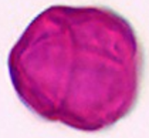 | tricolporaat (per monade in tetrade) | psilaat / psilaat (LM); fossulaat, psilaat (S | 26 µm–40 µm | *Calluna vulgaris* (struikheide); ook *Vaccinium myrtillus* | Anacardiaceae, Apiaceae, Araliaceae, Asteraceae, Caprifoliaceae, Elaeagnaceae, Fabaceae, Hippocastanaceae, Oleaceae, Rosaceae, Scrophulariaceae, Simaroubaceae, Vitaceae |
| Asparagus-type | 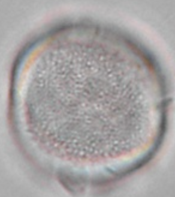 | monocolpaat, sulcaat | scabraat (LM); perforaat, microreticulaat (SEM) | 21 µm–25 µm | *Asparagus officinalis* (asperge) | Amaryllidaceae |
| Allium-type | 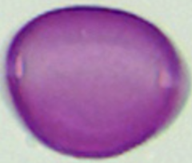 | monocolpaat | psilaat | 31 µm | *Allium ursinum* (daslook) | Asparagaceae, Commelinaceae |
| *Tradescantia andersoniana* |  | monocolpaat | rugulaat tot verrucaat | 44 µm | *Tradescantia andersoniana* (eendagsbloem) | Amaryllidaceae |
| Salix-type | 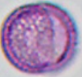 | tricolpaat (soms met duidelijke porie) | reticulaat (mazes kleiner naar de colpi) | 17 µm–26 µm | *Salix caprea* (boswilg) | Asteraceae, Brassicaceae, Fabaceae, Lamiaceae, Oleaceae, Sapindaceae |
| *Fraxinus excelsior* |  | tricolpaat, zelden tetracolpaat; apertuurmembranen niet geornamenteerd | reticulaat | 23 µm–28 µm | *Fraxinus excelsior* (es) | Asteraceae, Brassicaceae, Fabaceae, Lamiaceae, Salicaceae, Sapindaceae |
| Lamium-type | 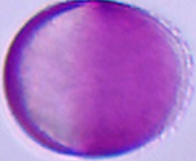 | tricolpaat | psilaat | 26 µm–29 µm | *Lamium album* (witte dovenetel) | Asteraceae, Brassicaceae, Fabaceae, Oleaceae, Salicaceae, Sapindaceae |
| Brassicaceae-type | 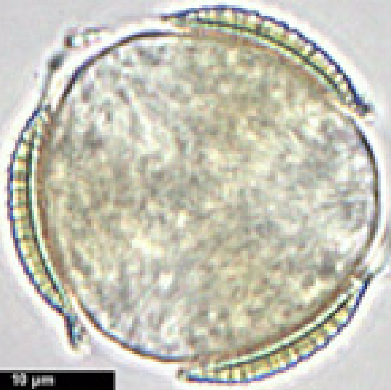 | tricolpaat | reticulaat | 21 µm–35 µm | *Brassica napus* (koolzaad); ook *Sinapis arvensis*, *Raphanus sativus* | Asteraceae, Fabaceae, Lamiaceae, Oleaceae, Salicaceae, Sapindaceae |
| Taraxacum-type | 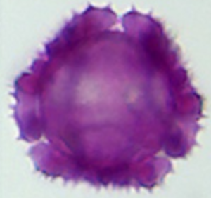 | tricolpaat, 3-4 slecht zichtbare aperturen | fenestraat, echinaat | 28 µm | *Taraxacum officinale* (paardenbloem) | Brassicaceae, Fabaceae, Lamiaceae, Oleaceae, Salicaceae, Sapindaceae |
| *Robinia pseudoacacia* | 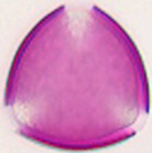 | tricolpaat; colpi aan de rand uitgefranst | scabraat | 30 µm | *Robinia pseudoacacia* (robinia) | Asteraceae, Brassicaceae, Lamiaceae, Oleaceae, Salicaceae, Sapindaceae |
| *Acer Platanoides* | 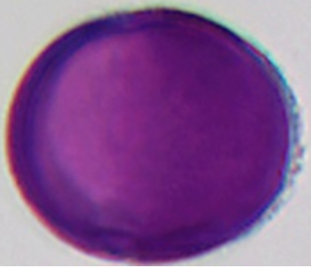 | tricolpaat | striaat | 30 µm–34 µm | *Acer Platanoides* (Noorse esdoorn) | Asteraceae, Brassicaceae, Fabaceae, Lamiaceae, Oleaceae, Salicaceae |
| *Rubus fruticosus* | 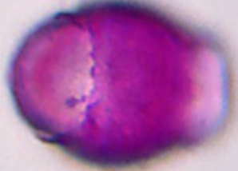 | tricolpaat | rugulaat, aperturen met gedeeltelijke korrelige ornamentatie | 29 µm–37 µm | *Rubus fruticosus* |  |
| Cirsium-type | 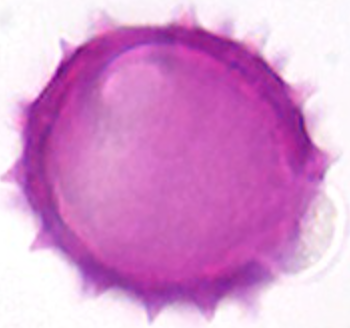 | tricolpaat | echinaat S | 60 µm | *Carlina acaulis* (zilverdistel) |  |
| *Spiraea japonica* | 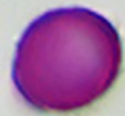 | tricolporaat | glad | 12 µm | *Spiraea japonica* (Japanse spirea) | Apiaceae, Asteraceae, Boraginaceae, Fabaceae, Hippocastanaceae, Scrophulariaceae, Simaroubaceae |
| *Castanea sativa* | 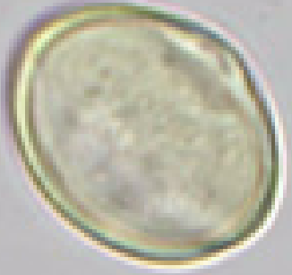 | tricolporaat | glad | 12 µm–14 µm | *Castanea sativa* (tamme kastanje) |  |
| *Cynoglossum officinale* | 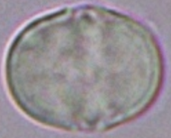 | tricolporaat; heteroaperturaat; margo; pseudocolpus; lalongaat | psilaat (LM); perforaat, psilaat (SEM) | 11 µm–15 µm | *Cynoglossum officinale* (echte hondstong) |  |
| *Hydrangea macrophylla* | 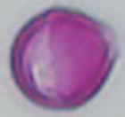 | tricolporaat | reticulaat | 12 µm–14 µm | *Hydrangea macrophylla* (hortensia) |  |
| *Filipendula ulmaria* | 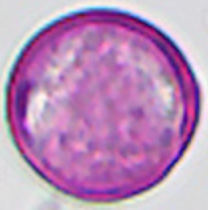 | tricolporaat | glad | 12 µm–16 µm | *Filipendula ulmaria* (moerasspirea) |  |
| *Echium vulgare* | 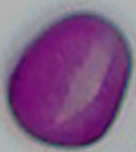 | tricolporaat; poren dichter bij de bredere pool | fijn reticulaat | 17 µm | *Echium vulgare* (slangenkruid) | Apiaceae, Araliaceae, Asteraceae, Fabaceae, Hippocastanaceae, Oleaceae, Rosaceae, Scrophulariaceae, Simaroubaceae |
| Anthriscus-type | 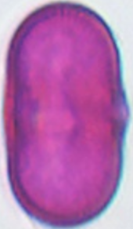 | tricolporaat; smalle colpi; porendiameter ca. 3.2 (2.5-4.6) µm | verrucaat | 13 µm–27 µm | *Anthriscus sylvestris* (fluitenkruid) | Anacardiaceae, Araliaceae, Asteraceae, Boraginaceae, Ericaceae, Fabaceae, Hippocastanaceae, Oleaceae, Rosaceae, Scrophulariaceae, Simaroubaceae |
| Fabaceae | 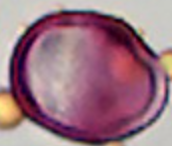 | tricolporaat | reticulaat, deels verrucaat / psilaat tot licht scabraat / reticulaat | 16 µm–24 µm | *Amorpha fruticosa* (valse indigo); ook *Lotus corniculatus*, *Melilotus albus*, *Ononis natrix* | Anacardiaceae, Apiaceae, Araliaceae, Asteraceae, Boraginaceae, Ericaceae, Hippocastanaceae, Oleaceae, Rosaceae, Scrophulariaceae, Simaroubaceae |
| *Rhamnus cathartica* |  | tricolporaat; margo; angulaperturaat | reticulaat (LM); SEM: reticulaat, rugulaat, perforaat | 16 µm–25 µm | *Rhamnus cathartica* (wegedoorn) |  |
| *Aesculus hippocastanum* | 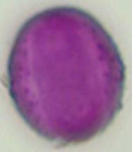 | tricolporaat | psilaat tot rugulaat | 24 µm | *Aesculus hippocastanum* (paardenkastanje) | Anacardiaceae, Apiaceae, Araliaceae, Asteraceae, Boraginaceae, Ericaceae, Fabaceae, Oleaceae, Rosaceae, Scrophulariaceae, Simaroubaceae, Vitaceae |
| *Cornus mas* | 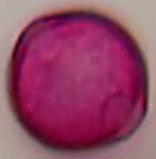 | tricolporaat | scabraat | 25 µm | *Cornus mas* (gele kornoelje) |  |
| *Verbascum thapsus* |  | tricolpaat tot tricolporaat; poren meestal niet duidelijk zichtbaar | reticulaat | 20 µm–31 µm | *Verbascum thapsus* (koningskaars) | Anacardiaceae, Apiaceae, Araliaceae, Asteraceae, Boraginaceae, Caprifoliaceae, Ericaceae, Fabaceae, Hippocastanaceae, Oleaceae, Rosaceae, Simaroubaceae, Vitaceae |
| *Ailanthus altissima* | 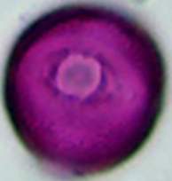 | tricolporaat, porus 5.5 µm | reticulaat tot gering striaat | 24 µm–28 µm | *Ailanthus altissima* (hemelboom) | Anacardiaceae, Apiaceae, Araliaceae, Asteraceae, Boraginaceae, Caprifoliaceae, Ericaceae, Fabaceae, Hippocastanaceae, Oleaceae, Rosaceae, Scrophulariaceae, Vitaceae |
| Achillea-type / Aster-Solidago-type / Helianthus-type / Taraxacum-type | 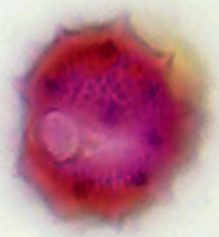 | tricolporaat | echinaat; echini ca. 3.3 µm; exine  / echinaat A / echinaat | 17 µm–36 µm | *Achillea millefolium* (gewoon duizendblad); *Solidago canadensis* (Canadese guldenroede); *Erigeron canaden* (Canad. fijnstraal); *Hieracium aurantiacum* (oranje havikskruid) | Anacardiaceae, Apiaceae, Araliaceae, Boraginaceae, Caprifoliaceae, Ericaceae, Fabaceae, Hippocastanaceae, Oleaceae, Rosaceae, Scrophulariaceae, Simaroubaceae, Vitaceae |
| *Hedera helix* |  | tricolporaat | reticulaat, heterobrochaat (brochi kleiner naar de colpi) | 26 µm–31 µm | *Hedera helix* (klimop) | Anacardiaceae, Apiaceae, Asteraceae, Boraginaceae, Caprifoliaceae, Elaeagnaceae, Ericaceae, Fabaceae, Hippocastanaceae, Oleaceae, Rosaceae, Scrophulariaceae, Simaroubaceae, Vitaceae |
| Prunus/Pyrus-type (~28 µm) |  | tricolporaat | striaat / striaat (LM zwak zichtbaar; lijkt g / striaat/rugulaat tot verrucaat/scab | 21 µm–36 µm | *Pyrus communis* (peer); ook *Fragaria vesca*, *Potentilla erecta*, *Rosa canina* | Anacardiaceae, Apiaceae, Araliaceae, Asteraceae, Boraginaceae, Caprifoliaceae, Elaeagnaceae, Ericaceae, Fabaceae, Hippocastanaceae, Oleaceae, Scrophulariaceae, Simaroubaceae, Vitaceae |
| *Ligustrum vulgare* |  | tricolpaat tot tricolporaat; apertuurmembranen niet geornamenteerd | reticulaat | 24 µm–34 µm | *Ligustrum vulgare* (liguster) | Anacardiaceae, Apiaceae, Araliaceae, Asteraceae, Boraginaceae, Caprifoliaceae, Elaeagnaceae, Ericaceae, Fabaceae, Hippocastanaceae, Rosaceae, Scrophulariaceae, Simaroubaceae, Vitaceae |
| *Rhus typhina* |  | tricolporaat; apertuurmembranen deels licht korrelig geornamenteerd | striaat tot reticulaat | 31 µm–34 µm | *Rhus typhina* (fluweelboom) | Apiaceae, Araliaceae, Asteraceae, Caprifoliaceae, Elaeagnaceae, Ericaceae, Fabaceae, Hippocastanaceae, Oleaceae, Rosaceae, Scrophulariaceae, Simaroubaceae, Vitaceae |
| Centaurea jacea-type | 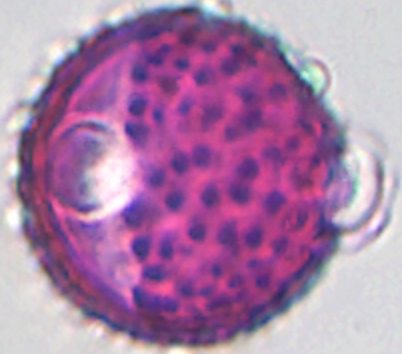 | tricolporaat | echinaat J | 31 µm–35 µm | *Centaurea jacea* (knoopkruid) | Anacardiaceae, Apiaceae, Araliaceae, Caprifoliaceae, Elaeagnaceae, Ericaceae, Fabaceae, Hippocastanaceae, Oleaceae, Rosaceae, Scrophulariaceae, Simaroubaceae, Vitaceae |
| Genista-type |  | tricolporoidaat tot tricolpaat | scabraat tot verrucaat | 31 µm–35 µm | *Genista tinctoria* (verfbrem) | Rosaceae |
| *Parthenocissus quinquefolia* |  | tricolporaat; colpi met margo | reticulaat tot rugulaat | 33 µm–38 µm | *Parthenocissus quinquefolia* (vijfbladige wingerd) | Anacardiaceae, Apiaceae, Araliaceae, Asteraceae, Caprifoliaceae, Elaeagnaceae, Ericaceae, Fabaceae, Hippocastanaceae, Oleaceae, Rosaceae, Scrophulariaceae, Simaroubaceae |
| Centaurea cyanus | 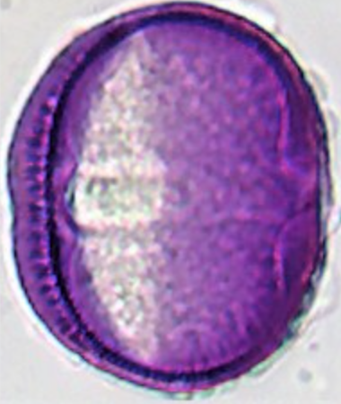 | tricolporaat | striaat; volgens PalDat LM echinaat | 31 µm–45 µm | *Centaurea cyanus* (korenbloem) |  |
| Heracleum-type | 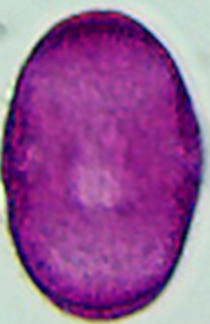 | tricolporaat | verrucaat tot scabraat | 35 µm–42 µm | *Heracleum sphondylium* (gewone berenklauw) | Anacardiaceae, Araliaceae, Asteraceae, Caprifoliaceae, Elaeagnaceae, Ericaceae, Fabaceae, Hippocastanaceae, Oleaceae, Polygonaceae, Rosaceae, Scrophulariaceae, Simaroubaceae, Vitaceae |
| Vicia-type | 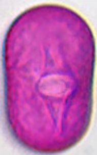 | tricolporaat | grof reticulaat / scabraat tot psilaat (LM geen retic | 35 µm–42 µm | *Vicia cracca* (vogelwikke); ook *Trifolium pratense* | Anacardiaceae, Apiaceae, Araliaceae, Asteraceae, Caprifoliaceae, Elaeagnaceae, Ericaceae, Hippocastanaceae, Oleaceae, Polygonaceae, Rosaceae, Scrophulariaceae, Simaroubaceae, Vitaceae |
| *Symphoricarpos albus* | 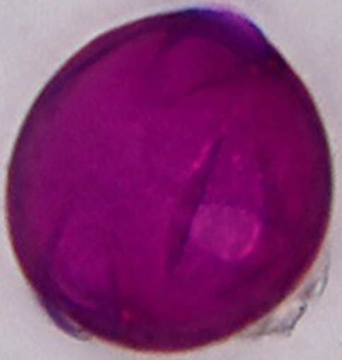 | tricolporaat | psilaat tot scabraat | 40 µm | *Symphoricarpos albus* (gewone sneeuwbes) | Anacardiaceae, Apiaceae, Araliaceae, Asteraceae, Elaeagnaceae, Ericaceae, Fabaceae, Oleaceae, Polygonaceae, Rosaceae, Scrophulariaceae, Simaroubaceae, Vitaceae |
| *Elaeagnus angustifolia* | 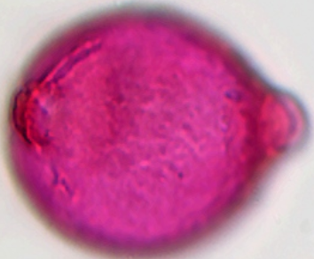 | tricolporaat | scabraat | 35 µm–50 µm | *Elaeagnus angustifolia* (smalbladige olijfwilg) | Anacardiaceae, Apiaceae, Araliaceae, Asteraceae, Caprifoliaceae, Ericaceae, Fabaceae, Oleaceae, Polygonaceae, Rosaceae, Vitaceae |
| Crataegus-type | 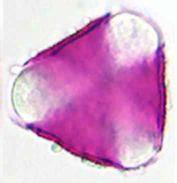 | tricolporaat; apertuurmembranen niet geornamenteerd | rugulaat tot striaat | 39 µm–46 µm | *Crataegus monogyna* (eenstijlige meidoorn) |  |
| Helianthus-type / Cirsium-type / Taraxacum-type | 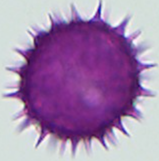 | tricolporaat | echinaat H / echinaat S / echinaat op verrucaat | 32 µm–54 µm | *Helianthus annuus* (zonnebloem); *Cirsium arvense* (akkerdistel); *Cichorium intybus* (cichorei) | Anacardiaceae, Apiaceae, Araliaceae, Caprifoliaceae, Elaeagnaceae, Ericaceae, Fabaceae, Oleaceae, Polygonaceae, Rosaceae, Vitaceae |
| Prunus/Pyrus-type (~44 µm) |  | tricolporoidaat | duidelijk striaat | 39 µm–49 µm | *Prunus domestica* (pruim) | Fabaceae |
| *Cornus sanguinea* | 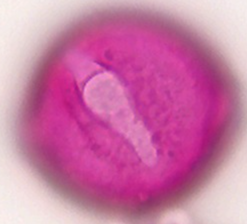 | tricolporaat | scabraat/reticulaat | 50 µm | *Cornus sanguinea* (rode kornoelje) |  |
| *Fagopyrum esculentum* | 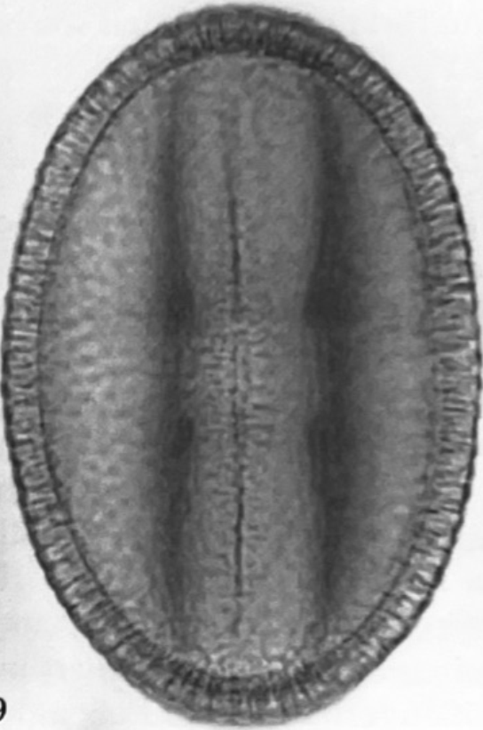 | tricolporaat (poren vaak niet te zien) | reticulaat, aperturen met korrelige ornamentering | 51 µm | *Fagopyrum esculentum* (boekweit) | Apiaceae, Asteraceae, Caprifoliaceae, Elaeagnaceae, Fabaceae |
| Cirsium-type / Centaurea jacea-type | 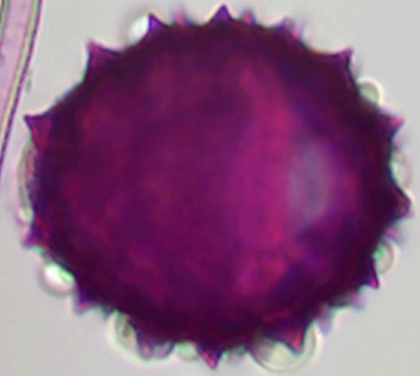 | tricolporaat | echinaat S / echinaat J | 50 µm–61 µm | *Cirsium vulgare* (speerdistel); *Carthamus tinctorius* (saffloer) | Caprifoliaceae, Elaeagnaceae, Polygonaceae |
| *Phacelia tanacetifolia* | 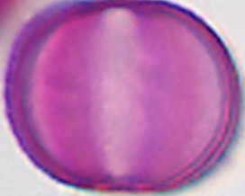 | stephanocolpaat tot heterocolpaat; 6 colpi, afwisselend breed en smal | scabraat tot psilaat | 19 µm–23 µm | *Phacelia tanacetifolia* (phacelia, bijenvoer) |  |
| Majoranus-type |  | stephanocolpaat; 6 colpi (Mentha-type) | reticulaat tot rugulaat | 28 µm–43 µm | *Origanum majorana* (marjolein) | Balsaminaceae |
| *Impatiens parviflora* |  | stephanocolpaat, tetracolpaat; meestal 4 smalle, korte colpi | grof reticulaat met grote brochi | 36 µm–41 µm | *Impatiens parviflora* (klein springzaad) | Lamiaceae |
| *Buddleja davidii* | 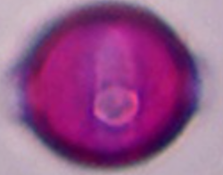 | stephanocolporaat | psilaat, evt. rugulaat | 14 µm–18 µm | *Buddleja davidii* (vlinderstruik) |  |
| *Symphytum officinale* | 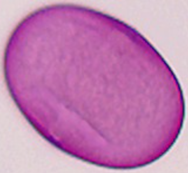 | stephanocolporaat; meestal 9-12 korte colpi | psilaat | 33 µm | *Symphytum officinale* (smeerwortel) |  |
| *Viola tricolor* | 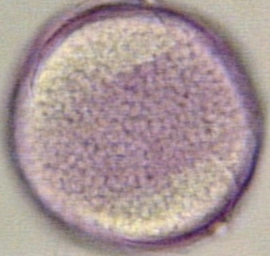 | 4-5-colporaat | gemmaat, scabraat, verrucaat (LM); perforaat (SEM) | 51 µm–100 µm | *Viola tricolor* (driekleurig viooltje) |  |
| *Myosotis scorpioides* | 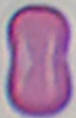 | heterocolpaat; 6 colpi; elke 2e colpus met porus | psilaat | 5 µm–9 µm | *Myosotis scorpioides* (vergeet-me-nietje) |  |
| *Jasione montana* |  | triporaat; apertuurmembraan geornamenteerd | echinaat (LM); perforaat, microechinaat (SEM) | 16 µm–25 µm | *Jasione montana* (zandblauwtje) |  |
| *Epilobium angustifolium* | 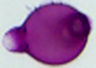 | triporaat; porenradius ca. 10 µm | rugulaat (Beug: psilaat met golvend oppervlak) | 75 µm–90 µm | *Epilobium angustifolium* (wilgenroosje) |  |
| *Ribes rubrum* | 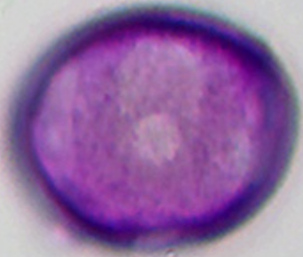 | periporaat; lacuna (brede verdieping) rond de poriën | scabraat | 25 µm–32 µm | *Ribes rubrum* (aalbes) | Caryophyllaceae |
| *Silene flos-cuculi* | 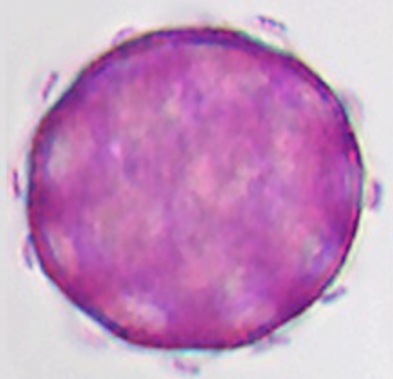 | periporaat | baculaat/verrucaat tot optisch reticulaat | 33 µm–37 µm | *Silene flos-cuculi* (echte koekoeksbloem) | Grossulariaceae |
| *Trifolium repens* | 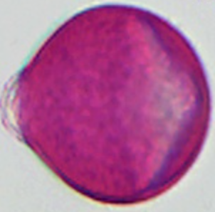 | [to be verified] | fijn reticulaat | 21 µm–25 µm | *Trifolium repens* |  |
| *Matricaria chamomilla* | 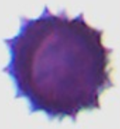 | [to be verified] | echinaat A | 26 µm | *Matricaria chamomilla* (echte kamille) |  |
| *Anchusa officinalis* | 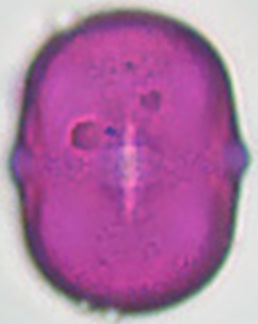 | [to be verified] | glad/foveolaat tot rugulaat | 26 µm–37 µm | *Anchusa officinalis* (gewone ossentong) |  |
| *Impatiens glandulifera* |  | [to be verified] | [to be verified] | [to be verified] | *Impatiens glandulifera* (Reuzenbalsamine) |  |
| *Persicaria maculosa* |  | [to be verified] | [to be verified] | [to be verified] | *Persicaria maculosa* |  |
| *Polygonum aviculare* |  | [to be verified] | [to be verified] | [to be verified] | *Polygonum aviculare* (Zwaluwtong) |  |
| *Populus nigra* | 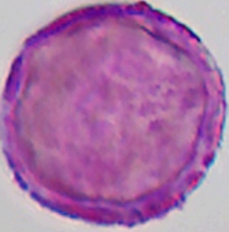 | [to be verified] | [to be verified] | [to be verified] | *Populus nigra* (zwarte populier) |  |
| *Ranunculus repens* |  | [to be verified] | [to be verified] | [to be verified] | *Ranunculus repens* |  |
| *Tilia Platyphyllos* | 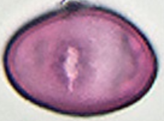 | [to be verified] | [to be verified] | [to be verified] | *Tilia Platyphyllos* |  |
