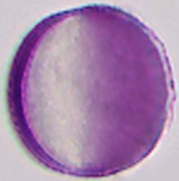
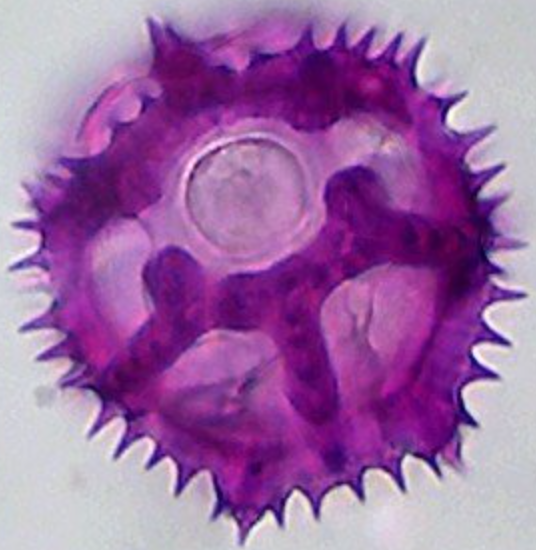

# Detailvergroting

Voor het analyseren van structurele kenmerken van individuele pollen is 400x vergroting (40x objectief bij de meeste microscopen) voldoende om onderstaande kenmerken te onderscheiden.

## Diameter
- Meet de pollen inclusief uitstekende delen zoals spinea of verrucea.
- Of schat de diameter aan de hand van pollen met een bekende diameter.

De eenheid in de palynologie (en microscopie in het algemeen) is de micron of micrometer, waarbij 1 μm = 1/1000 mm. 

### Echte-schaal beelden (vaste afbeeldingslogica)
Een microscoopfoto kan misleidend lijken, omdat de vergroting per foto verschilt; daarom werken we met vaste weergaveschalen in de determinatiepagina’s.

- **Schaalregel (PollenID)**: 10 μm = 50 px (dus 1 μm = 5 px).
- **Voorbeeld**: 34 μm → 170 px (zoals bij *Tilia* op de pagina `lindehoning`).
- **Praktisch**: alle kleurbeelden op een pollenpagina krijgen dezelfde breedte (op basis van de opgegeven `Pollenkorrelgrootte`), met daaronder een grijswaarde referentiebeeld uit `docs/assets/images/pollenwiki/*_size_*.png`.

  

    <figure class="pid-scale-item">
      
      <figcaption class="pid-scale-caption">Echium (17 µm)</figcaption>
    </figure>
    <figure class="pid-scale-item">
      
      <figcaption class="pid-scale-caption">Corylus (26 µm)</figcaption>
    </figure>
    <figure class="pid-scale-item">
      
      <figcaption class="pid-scale-caption">Brassica (26 µm)</figcaption>
    </figure>
    <figure class="pid-scale-item">
      
      <figcaption class="pid-scale-caption">Cichorium (40 µm)</figcaption>
    </figure>
  

### Diameter verdeelt in vijf klassen
**Sawyer** gebruikt hiervoor 5 groepen en gebruikt Corylus (hazelaar) pollen als referentie.

1. Zeer klein: &lt; 20 μm (&lt;1 × Corylus)
2. Klein: 20–30 μm (1 × Corylus)
3. Middel: 30–50 μm (&gt;1 × Corylus)
4. Groot: 50–100 μm (2 × Corylus)
5. Zeer groot: &gt; 100 μm (4 × Corylus)

**Beug** gebruikt andere afkappunten voor zeer klein, klein en middel.

1. Zeer klein: &lt; 15 μm
2. Klein: 15 tot 25 μm
3. Middel: 26 tot 50 μm
4. Groot: 51 tot 100 μm
5. Zeer groot: &gt; 100 μm

### Diameter verdeelt in drie klassen
1. Klein: Wilg ([Salix](https://pollenx.eu/species.php?species=Salix_alba)) - veelvoorkomend, 19-25 μm
2. Middel: Witte klaver (Trifolium repens) - meest voorkomend, 25-35 μm
3. Groot: Linde (Tilia) - karakteristiek, 30-40 μm

### Praktische meetmethoden

1. **Oculairgraticule**  
   Gebruik een geijkt oculair met schaalverdeling. Bij veel opstellingen met 40x objectief komt 1 kleine deelstreep overeen met circa 2,5 μm en 1 grote met 25 μm.
2. **Interne referentie met Corylus**  
   *Corylus* (hazelaar) is vaak rond 25 μm en werkt als snelle visuele maatreferentie tijdens routine-analyse.

Note: exacte schaalwaarden hangen af van jouw microscoopconfiguratie en moeten lokaal geijkt zijn.

## Vorm
1. rond of onregelmatig rond
2. ovaal, afgeplat
3. ovaal, langwerpig
4. lang
5. driehoekig
6. halfrond of bootvormig
7. meer-zijdig of irregulair

## [Appertuur typen](https://pollen.tstebler.ch/MediaWiki/index.php?title=Kategorie:Pollenklasse)
Copi (langgerekt) en poren (rond)
Aantallen varieren van nul tot meer dan twaalf.
### Colpi
Alleen lang gerekte opening
- Monocolpaat
- Dicolpaat
- Tricolpaat
- Stephanocolpaat
### Poren
Alleen ronde opening
- [Monoporaat](https://pollen.tstebler.ch/MediaWiki/index.php?title=Kategorie:Monoporat)
  - [Zea mays](https://pollenx.eu/species.php?species=Zea_mays) (maïs)
  - andere grassen
- Diporaat
- Triporaat
- Stephanoporaat (>3 poren ter plaatse van de equator)
- Periporaat
### Colporaat
- Tricolporaat
- Stephanocolporaat
- Pericolporaat
- Heterocolporaat
### Fenestraat

## Oppervlak
Bij micrometeren (kleine stelschroef om scherp te stellen beetje heen en weer draaien) geeft soms een ander beeld. Hierdoor kan het lastig zijn om bijvoorbeeld netwerk of punctate patronen te onderscheiden. En omdat palynologie nooit saai is maken verschillende auteurs maken verschillende onderverdelingen. Van slechts enkele soorten oppervlak structuren tot onderverdelingen waarbij eigenlijk een electronenmicroscoop nodig is om ze te kunnen onderscheiden. Op papier zien de structuren en verschillend uit, in de praktijk kan het tegenvallen om ze te onderscheiden. Niet alle kenmerken zijn bij 400x vergroting goed te onderscheiden.

### Psilaat (glad)
Als een biljarbal, maar de onduidelijke patronen mogen van veel auteurs ook onder deze categorie.

### Reticulaat (netwerk)

#### Fijn netwerk
#### Grof netwerk
### Striaat en rugulaat (strepen en ribbels)
Oppervlak bevat strepen, ribbels of richels, soms vertakkend
### Echinaat (stekels)

### Verrucaat (wratachtig)

## Exine
1. Dun
2. Middel, geen staven
3. Middel met verdeelde staven of kralen
4. Middel of dik met grove uitwendige staven
5. Laag van dichte, dunne staven
6. Lange, dunne staven
7. Grote, stekels met brede basis
8. Kleine of zeer kleine stekels of wratten
9. Andere uitsteeksels

## Exine
### Dun
Buitenste laag kleurt aan als een donkere lijn (Rumex (zuring). Melilotus (honingklaver))
### Middel, geen staven
2 lagen duidelijk te onderscheiden (Rubus (braam))
### Middel met kolommen of kralen
Twee gekleurde lagen met een rij van pijlers er tussen. Hierbij kan de buitenlaag (tectum) onvolledig zijn (Heracleum (berenklauw) Brassica napus (, koolzaad))
### Middel of dik met grove uitwendige staven
Grote vierkante of rechthoekige staven zoals bij Ilex (hulst)
### Laag van dichte dunne staven
deze kunnen vertakt of vezelig lijken
(Scabiosa (schurftkruid), Chrysanthemum (margriet)).
**Lange, dunne stekels** ((Malva (Kaasjeskruid). 
**Grote stekels met een brede basis** (Fig. 5g) (Aster (Herfstaster)). 
**Kleine of zeer kleine stekels of wratjes** (Lonicera (Kamperfoelie)Valeriana (Valeriaan))
Andere uitsteeksels (Viscum Maretak).

## Composieten
De ene stekelbol is de andere niet. De Compositae-familie kan in 7 hoofdtypen worden verdeelt
1. Taraxacum (paardenbloem)-type
2. Helicanthus (zonnebloem)-type

### Look-a-likes
Dit komt veel voor bij pollen van een geslacht. Zo is het pollen van Tilia (linde) een van de eerste pollen die herkent wordt, maar om de soort aan te geven is veel lastiger. Voor honinganalyse worden deze pollen geidentificeerd als:
- [Tilia](https://pollenx.eu/species.php?species=Tilia_platyphyllos) (lindeboom)-type
- [Prunus](https://pollenx.eu/species.php?species=Prunus)/[Pyrus](https://pollenx.eu/species.php?species=Pyrus_communis) (fruitbloesem)-type
Type honing en daarmee planten die voorkomen in gebied waar de honig vandaan komt en informatie over de bloeitijd van de drachplanten, oa te vinden op [drachtplanten van imkerpedia](https://www.imkerpedia.nl/wiki/index.php/Drachtplanten) na sorteren op startbloeiperiode (SB) en eindebloeiperiode (EB)

## Afwijkende korrels herkennen

- **Abortieve/verschrompelde korrels**: zwellen niet of nauwelijks en vertekenen vormvergelijking.
- **Reuzen- en dwergkorrels**: incidenteel binnen hetzelfde taxon; meet meerdere korrels voordat je een klasse kiest.
- **Apertuurvariatie**: bij sommige groepen komen 3- en 4-apertuurvarianten naast elkaar voor.

## Drachtplantgegevens (Imkerpedia)

- Latijnse naam: *Zea mays*
- Nederlandse naam (Imkerpedia): Mais
- Voorkomen: 1-jarig
- Stuifmeelkleur: Citroengeel
- Nectarwaarde: N 0
- Pollenwaarde: P 5
- SB: 6
- EB: 8
- Bron: [Imkerpedia - Drachtplanten](https://www.imkerpedia.nl/wiki/index.php/Drachtplanten)

# Bestimmungshulp en categorieën (Pollen-Wiki)

Deze pagina bundelt de kern van de Duitse pagina's **Kategorien** en **Bestimmungshilfe** in een compact Nederlandstalig naslagformaat.

## Snelle werkwijze bij determinatie

Gebruik per onbekende korrel steeds dezelfde volgorde:

1. Wat is de grootteklasse?
2. Wat is de vorm en polariteit?
3. Hoeveel aperturen zijn zichtbaar?
4. Welk apertuurtype zie je (porie, colpus, combinatie)?
5. Wat is het ornamentatietype?
6. Welke aanvullende kenmerken vallen op?

## Veelgebruikte afkortingen

- **LM**: lichtmicroscoop
- **SEM/REM**: scanning-elektronenmicroscopie
- **PK**: pollenkorrel
- **PoFormI (P/E)**: pollenvormindex
- **PolFeldI**: polairveldindex

## Grootteklassen

| Grootteklasse | Diameter (gemiddeld) |
|---|---|
| VerySmall | < 15 um |
| Small | 15-25 um |
| Medium | 26-50 um |
| Large | 51-100 um |
| VeryLarge | > 100 um |

## Pollenvormindex (PoFormI / P/E-ratio)

| Klasse | P/E |
|---|---|
| Peroblaat | < 0.5 |
| Oblaat | 0.5-0.75 |
| Sferoidaal | 0.75-1.33 |
| Prolaat | 1.33-2.0 |
| Perprolaat | > 2.0 |

## Polairveldindex (PolFeldI)

| Klasse | PolFeldI |
|---|---|
| Klein | < 0.25 |
| Middelgroot | 0.25-0.5 |
| Groot | > 0.5-0.74 |
| Zeer groot | > 0.75 |

## Pollenklassen (Beug-indeling)

| Nr. | Pollenklasse | Praktische omschrijving |
|---|---|---|
| 03 | Polyad | Meer dan 4 subeenheden |
| 04 | Tetrad | 4 subeenheden |
| 05 | Dyad | 2 subeenheden |
| 06 | Vesiculaat | 2 luchtzakken |
| 07 | Inaperturaat | Geen duidelijke aperturen |
| 08 | Monoporaat | 1 porie |
| 09 | Monocolpaat | 1 colpus |
| 10 | Syncolpaat | Colpi verbonden over pool/ring |
| 11 | Dicolpaat | 2 colpi |
| 12 | Dicolporaat | 2 colpi met 2 poriën |
| 13 | Tricolpaat-psilaat | 3 colpi, psilaat/scabraat/(micro)verrucaat |
| 14-15 | Tricolporaat-psilaat | 3 colpi + (soms) 3 poriën, psilaat/scabraat/(micro)verrucaat |
| 16 | Tricol-clavaat | Tricolpaat/-poraat met clavate/baculate/verrucate sculptuur |
| 17 | Tricol-echinaat | Tricolpaat/-poraat met echinate sculptuur |
| 18 | Tricolpaat-striaat | 3 colpi met striate/striat-reticulate/rugulate sculptuur |
| 19-20 | Tricolporaat-striaat | Tricolporaat met striate/striat-reticulate/rugulate sculptuur |
| 21 | Tricolpaat-reticulaat | 3 colpi met (micro)reticulate sculptuur |
| 22-23 | Tricolporaat-reticulaat | Tricolporaat met (micro)reticulate/fossulate sculptuur |
| 24 | Stephanocolpaat | > 3 colpi, met equator |
| 25 | Stephanocolporaat | > 3 colpi met poriën, met equator |
| 26 | Pericolpaat | > 3 onregelmatige colpi, zonder duidelijke equator |
| 27 | Pericolporaat | > 3 colpi met poriën, zonder duidelijke equator |
| 28 | Heterocolpaat | Minstens 6 colpi, deel met extra porie |
| 29 | Fenestraat | Vensterachtig exinepatroon |
| 30 | Diporaat | 2 poriën |
| 31 | Triporaat | 3 poriën |
| 32 | Stephanoporaat | Meestal 4-6 poriën in equatoriale gordel |
| 33 | Periporaat | > 3 poriën over hele oppervlak |
| 34 | Onbekend | Niet classificeerbaar |
| 35 | Diversen | Restcategorie |
| 36 | Sporen | Sporen i.p.v. angiosperm pollen |

## Notitie voor gebruik in deze documentatie

- Deze pagina is bedoeld als snelle besliskaart naast `naslag/vergelijking-determinatie-sleutels.md`.
- Voor uitgebreide literatuur en context blijft `naslag/referenties.md` leidend.
- Sommige termen zijn vertaald naar praktische Nederlandse werktaal; originele Duitstalige labels kunnen in bronliteratuur afwijken.
# Wat noteren bij pollenobservatie (zonder SEM)

Deze checklist is gebaseerd op de velden uit *Pollen Diagnosis - PalDat Worksheet* (2020), met focus op lichtmicroscopie (LM).  
SEM- en TEM-specifieke velden zijn bewust weggelaten.

## 1) Taxon en context
- Taxon (voorlopige naam of werkhypothese).
- Familie en orde (indien bekend).
- Eventuele synoniemen die je in je bron gebruikt.

## 2) Eenheid en afmetingen (LM)
- Pollen unit (monade, tetrade, polyade, enz.).
- Grootte van gehydrateerd pollen (LM).
- Kortste poolas in equatoriaal beeld (LM).
- Langste poolas in equatoriaal beeld (LM).
- Kortste diameter in equatoriaal of polair beeld (LM).
- Langste diameter in equatoriaal of polair beeld (LM).

## 3) Aperturen
- Aantal aperturen.
- Toestand van aperturen (duidelijk, onduidelijk, ingestulpt, etc.).
- Type apertuur (bijv. colpus/porus/combinatie).
- Bijzonderheden aan aperturen (rand, verbreding, vervorming).

## 4) Polarity en vorm (droog pollen)
- Polarity (isopolair/heteropolair waar toepasbaar).
- P/E-verhouding (droog pollen).
- Vorm op basis van P/E (prolaat, oblaat, sferoidaal, etc.).
- Omtrek in polair beeld.
- Eventuele invouwingen in polair beeld.

## 5) Oriëntatie tijdens observatie
- Dominante oriëntatie onder LM (polair/equatoriaal/schuin).

## 6) Ornamentatie en wandkenmerken (LM)
- Ornamentatie in LM (bijv. psilaat, reticulaat, echinaat, striaat).
- Wand-bijzonderheden die onder LM zichtbaar zijn (dikteverschillen, contrast, structuurindruk).

## 7) Overige observaties
- Eventuele pollen-coatings of aankleuring aan het oppervlak.
- Opmerkingen/annotaties (onzekerheden, artefacten, vergelijking met referentiepreparaat).

## 8) Praktisch notatieformat (kort)
Gebruik per korreltype een vaste volgorde:
1. Taxonhypothese
2. Afmetingen
3. Aperturen
4. Vorm + oriëntatie
5. Ornamentatie
6. Opmerkingen

Zo kun je later sneller vergelijken tussen preparaten en tussen look-a-like typen.

## Bron
- *Pollen Diagnosis - PalDat Worksheet* (© PalDat, 2020), velden op pagina 1 van 2.
# Terminologie

## Opbouw van de pollenkorrelwand
**2 beschermende lagen**: de intine en de exine. 
### Intine
De **intine** is een semipermeabel membraan. Ze kleurt niet in onze preparaten. In doorsnede is ze herkenbaar als een dunne, heldere lijn rond de celinhoud, die door de aperturen in de exine kan uitpuilen of eronder verdikkingen kan vormen (Bryonia, bryonie, Pl. 114; Corylus, hazelaar, Pl. 140). 
### Extine
De **exine** is een buitenlaag met complexe structuur. Ze bestaat uit een zeer duurzaam materiaal dat zelfs in fossiele vorm bewaard blijft; wordt gewoonlijk 'sporopollenine' genoemd. De exine zelf bestaat uit lagen (Fig. 1b; Pl. 224). De volgende namen voor exine-componenten zijn aangehouden als eenvoudig en bruikbaar, terwijl de terminologie van de pollenwand nog in discussie is:

(i) De basis is een heldere, gelijkmatige laag; het buitenste deel kan kleuren en een donkere lijn tonen in optische doorsnede van de korrel.

(ii) **kolommen** zijn radiaal ten opzichte van de basis gerangschikt. 
(iii) Het **tectum** vormt een dak over de staven. Dit kan onvolledig zijn zodat sommige staven vrij staan.

(iv) Ornamentatie wordt gevormd door een laag stekels of andere uitsteeksels op het tectum.

Niet alle lagen zijn bij alle pollensoorten aanwezig. De aanwezige lagen vertonen veel variaties die nuttig zijn bij het herkennen van een bepaald pollen. 

**Aperturen** zijn zichtbaar op het oppervlak van het pollen, gevormd door verdunning of afwezigheid van sommige exinelagen. 

Ze worden beschreven als: **groeven of colpi** als ze langwerpig zijn en meestal naar de uiteinden toelopen; **poriën** als ze rond of ovaal zijn. Poriën en groeven komen vaak samen voor maar op verschillende niveaus van de exine. Aperturen laten de korrel **uitdrogen of water opnemen** en zo in gezwollen toestand komen. Ze vormen ook de **uitgang voor de pollenbuis** bij kieming.

MORFOLOGISCHE REGIO'S

Posities op het oppervlak van een pollenkorrel worden beschreven met de bekende namen voor de regio's van de aarde (Fig. 2). 
De **poolgebieden** zijn de 2 tegenoverliggende gebieden zonder aperturen. De **equator** is het oppervlakgebied halverwege de polen. De **poolaanzicht** is richting een poolgebied. Het **equatoriale of zijaanzicht** is richting de evenaar. De groeven lopen in de lengte met hun uiteinden naar de poolgebieden. De aperturen liggen doorgaans op de evenaar, maar poriën komen vaak verspreid over het hele korreloppervlak voor.

## Kenmerken in de praktijk

Voor beschrijvingen op circa 400x worden dezelfde hoofdgroepen gebruikt als in klassieke sleutels:

- **Grootte** (inclusief stekels/ornamentatie)
- **Vorm** (afhankelijk van aanzicht: pool of equatoriaal)
- **Aantal aperturen**
- **Apertuurtype** (poren, colpi of gecombineerd)
- **Oppervlak** (glad, korrelig, gestreept, net/punctaat, stekelig)
- **Exine in optische doorsnede**
- **Andere structurele kenmerken** (bijv. intinezwelling, kappen, tetraden)
- **Pollenkleur** (vooral relevant bij vers bulkpollen of bijenlading)

## Meten van grootte

De maximale diameter wordt genoteerd, inclusief ornamentatie. In de praktijk zijn twee meetroutes bruikbaar:

1. **Oculairgraticule**  
   Bij een 40x objectief is een kleine deelstreep vaak 2,5 μm en een grote streep 25 μm (afhankelijk van kalibratie van jouw microscoop).
2. **Corylus-referentie**  
   *Corylus* (hazelaar) is vaak een praktische interne maatreferentie rond 25 μm.

## Onregelmatige korrels

Niet elke korrel in een preparaat is "schoolvoorbeeld". Let expliciet op afwijkingen:

- **Verschrompelde of abortieve korrels** die niet goed zwellen bij montage.
- **Reuzen- en dwergkorrels** binnen hetzelfde type.
- **Variatie in apertuuraantal** (bijv. 3- versus 4-groeven-varianten).
- **Abnormale of onregelmatige groeven** die op breuken kunnen lijken.

Deze varianten kunnen determinatie verstoren en moeten eerst als afwijkend worden herkend, vóór je een type toekent.

## Pollen-typen en determinatiegrenzen

In honingpreparaten is soortniveau niet altijd haalbaar. Daarom wordt vaak op **type-niveau** gedetermineerd:

- Sommige taxa zijn relatief onderscheidend (bijv. *Trifolium repens* en *Trifolium pratense*).
- Veel groepen worden als type benoemd (bijv. **Tilia-type**, **Prunus/Pyrus-type**, composieten-typen).
- Binnen gemengde monsters blijft context essentieel: **lokale flora** en **bloeitijd** helpen de keuze verfijnen.

Determinatie is dus een combinatie van morfologie, preparaatkwaliteit en ecologische context.

## Aanvullende notatie en termen

### Apertuuroriëntatie

- **Lolongaat**: porie-oriëntatie in de lengterichting van de colpus.
- **Lalongaat**: porie-oriëntatie in de breedterichting van de colpus.
- **Colp(or)aat**: gebruikt wanneer in praktijk niet zeker is of een opening als colpus of porie moet worden gelezen.

### Wandlagen (praktisch gebruik)

- **Sexine**: buitenste, gesculpteerde deel van de exine.
- **Nexine**: binnenste, meestal minder gesculpteerde deel van de exine.
- **Infratectum**: zone met columellae tussen voetlaag en tectum.
- **Sporopollenine**: zeer resistent biopolymeer waaruit de exine grotendeels bestaat.

### Veelgebruikte afkortingen in werkaantekeningen

- **l / br / f / zw**: lang, breed, fijn, zwak.
- **ex / in**: exine, inhoud (contextafhankelijk in notities).
- **Bn / Si**: *Brassica napus* (koolzaad), *Sinapis arvensis* (herik) als veelgebruikte referenties.

## Pollenklassen en verspreidingseenheden

### Apertuurverdeling

- **Triporaat**: drie poriën.
- **Tricolporaat**: drie colpi met drie poriën.
- **Stephanocolpaat**: vier of meer colpi in (ongeveer) equatoriale gordel.
- **Stephanocolporaat**: vier of meer colpi met poriën in (ongeveer) equatoriale gordel.
- **Stephanoporaat**: vier of meer poriën in (ongeveer) equatoriale gordel.
- **Pericolpaat**: meer dan drie colpi, niet strikt equatoriaal beperkt.
- **Pericolporaat**: meer dan drie colpi met poriën, niet strikt equatoriaal beperkt.
- **Periporaat**: poriën verspreid over vrijwel het hele korreloppervlak.
- **Heterocolpaat**: verschillende colpustypen binnen dezelfde korrel (bijv. combinatie met/zonder poriën).
- **Inaperturaat**: korrel zonder herkenbare aperturen.
- **Syncolpaat**: colpi die met elkaar verbonden zijn (samenvloeiend apertuurpatroon).
- **Heterocolp(or)aat**: combinatievorm waarbij colpi en pori in één korrelpatroon ongelijk verdeeld zijn.

### Eenheid van verspreiding

- **Monade**: losse pollenkorrel.
- **Tetrade**: groep van vier samenhangende pollenkorrels.
- **Polyade**: groep van meer dan vier samenhangende pollenkorrels.
- **Vesiculaat**: korrel met luchtzakken (klassiek vooral bij coniferenpollen).
- **Fenestraat**: korrel met vensterachtige exine-openingen.

## Inbrengroutes van pollen in honing

- **Primaire inbreng**: pollen dat direct via bloembezoek met nectar in de honingketen terechtkomt.
- **Secundaire inbreng**: pollen (vaak van windbloeiers) dat via haarkleed of omgeving bijkomend in honing belandt.
- **Tertiaire inbreng**: pollen dat door imkerhandelingen extra wordt ingebracht (historisch bijvoorbeeld bij uitpersen van raten).

Deze driedeling helpt bij interpretatie van over- of ondervertegenwoordigde pollentypen in preparaten.

## Melissopalynologie in uniflorale diagnose

- **Ondervertegenwoordigd pollen**: een drachtplant waarvan pollen in honing relatief laag voorkomt t.o.v. het werkelijke nectar-aandeel.
- **Oververtegenwoordigd pollen**: een planttype waarvan pollen relatief hoog voorkomt t.o.v. het nectar-aandeel.
- **Normaal vertegenwoordigd pollen**: pollenfractie die grofweg evenredig volgt met de nectarbijdrage in de honing.
- **Specifiek pollen (%)**: relatieve fractie van één pollentype binnen de getelde pollen.
- **Absoluut pollenaantal (PG/10 g)**: totaal aantal plantelementen/pollen per 10 g honing in kwantitatieve melissopalynologie.

Deze termen ondersteunen de praktijkregel dat botanische typering in uniflorale honing niet op één drempel mag steunen, maar op een gecombineerd referentiebeeld [to be verified].

## Aanvullende internationale termen (2018)

Deze termen zijn toegevoegd op basis van *Illustrated Pollen Terminology* (2e editie, 2018) en zijn vooral nuttig bij het lezen van internationale literatuur.

### Apertuur- en wandtermen

- **Poroid / poroidaat**: onduidelijke, ongeveer ronde of elliptische apertuur; overgangsvorm tussen duidelijke porie en diffuse opening.
- **Pororaat** (*pororate*): samengestelde apertuur met een buitenste porie (ektoporus) en binnenste porie (endoporus).
- **Ringvormige apertuur** (*ring-like aperture*): circumferentiële opening, meestal in de equatoriale zone.
- **Pontoperculum / pontoperculair**: langgerekt operculum dat met de uiteinden aan de apertuur verbonden is.
- **Pseudocolpus**: colpus-achtige structuur in heteroaperturate pollen die vermoedelijk geen kiemplaats is.

### Ornamentatie en structuur

- **Brochus**: individuele "cel" binnen een reticulum (één lumen met omliggende muri).
- **Reticulum**: netwerkpatroon van de exine, opgebouwd uit muri en lumina.
- **Rugulae / rugulaat**: onregelmatig gerangschikte, langgerekte reliëfelementen.
- **Scabraat** (*scabrate*): zeer fijne, moeilijk scherp begrensde sculptuur nabij de resolutiegrens van lichtmicroscopie.
- **Semitectaat**: exine-opbouw met onderbroken (niet-continu) tectum.

### Vorm en functionele termen

- **Proximaal / distaal**: oriëntatie t.o.v. de tetrade-ontwikkeling (naar het tetradecentrum / ervan af).
- **Harmomegathie**: vormverandering van de korrel door hydratatie en dehydratie (zwellen/krimpen) tijdens dispersie en preparatie.
- **Eurypalyn**: soort met relatief brede natuurlijke morfologische variatie van pollen.
- **Stenopalyn**: soort met relatief uniforme, weinig variabele pollenmorfologie.

## Aanvullende termen uit Melissopalynology (2025)

### Morfometrie en oriëntatie

- **Mesocolpium**: afstand/zone tussen twee colpi; vaak gebruikt als kwantitatieve vergelijkingsmaat.
- **Isopolair**: pollen met vergelijkbare polaire uiteinden (geen duidelijk verschillend proximaal/distaal poolbeeld).
- **Radiaal symmetrisch**: symmetrie rond de lengteas van de korrel.
- **P/E-ratio**: verhouding van pooldiameter (P) tot equatoriale diameter (E), gebruikt voor vormclassificatie.
- **Polairveldindex (d/D, PFeldI)**: verhouding tussen de diameter van het polaire veld (d) en de totale korreldiameter in poolaanzicht (D).

### Exine en ornamentatie

- **Echino-lophate**: stekelig patroon gecombineerd met lophate (rug-/kamachtige) structuren.
- **Fenestrate**: exine met vensterachtige openingen/velden.
- **Lacunae**: relatief grotere open velden tussen ornamentatie-elementen (bijv. tussen stekelzones).
- **Echino-perforaat**: stekelig exinepatroon met perforaties in de tussenruimten.

# Fægri en Iversen: terminologie (TPA)

Dit naslagblad vat kerntermen samen uit *TPA Morphological glossary* voor praktische determinatie met lichtmicroscopie.

**Status:** OCR-bron gebruikt; details zijn [to be verified] tegen originele tabellen/platen.

## Kerntermen

- **Apertuur**: Openings- of dunnere zone in de exine; cruciaal voor pollenbuis en hydratatie.
- **Colpus (colpaat)**: Langgerekte apertuur met lengte groter dan breedte.
- **Pore (poraat)**: Meer ronde apertuur met lengte/breedte < 2.
- **Colporaat**: Combinatie-apertuur: buiten colpoid, binnen poroid.
- **Annulus**: Verdikte exinerand rondom porie.
- **Margo**: Apertuurrand met afwijkende structuur/ornamentatie.
- **Tectum**: Buitenste deklaag van de exine (tectaat, semitectaat, intectaat).
- **Ektexine**: Buitenste exinedeel (incl. tectum, columellae, foot layer).
- **Endexine/Nexine**: Binnenste exinedeel; zichtbaar in optische doorsnede.
- **Columellae**: Staafvormige elementen tussen voetlaag/endexine en tectum.
- **Reticulum / lumen / muri**: Netwerkpatroon; lumina zijn openingen, muri zijn netwanden.
- **Psilaat / scabraat**: Zeer fijne sculptuur (<1 μm) of vrijwel glad.
- **Verrucaat / echinaat**: Wrat- of stekelvormige sculptuur (>1 μm).
- **Striaat / rugulaat**: Subparallelle vs. onregelmatig langgerekte richels.
- **Stephanoporaat/-colpaat**: Meer dan drie aperturen op ongeveer equatoriaal niveau.
- **Periporaat/-colpaat**: Aperturen over het hele korreloppervlak verdeeld.
- **Harmomegathos**: Mechanisme van volumeverandering van de pollenkorrel bij wateropname/-verlies.
- **Polar axis (P) en equatoriale diameter (E)**: Basis voor vormclassificatie via P/E-verhouding.

## Didactische volgorde bij determinatie

- Begin met aperturen (type, aantal, rangschikking).
- Beoordeel daarna exinestructuur en ornamentatie.
- Gebruik metingen als ondersteunend criterium, niet als enige beslisser.
- Controleer bij twijfel parallelle sleutelroutes (bijv. triaperturaat vs periaperturaat).
