# All confirmed lookalikes — true scale (ratings applied)

## Index

[#1](#n1) · [#2](#n2) · [#3](#n3) · [#4](#n4) · [#5](#n5) · [#6](#n6) · [#7](#n7) · [#8](#n8) · [#9](#n9) · [#10](#n10) · [#11](#n11) · [#12](#n12) · [#13](#n13) · [#14](#n14) · [#15](#n15) · [#16](#n16) · [#17](#n17) · [#18](#n18) · [#19](#n19) · [#20](#n20) · [#21](#n21) · [#22](#n22) · [#23](#n23) · [#24](#n24) · [#25](#n25) · [#26](#n26) · [#27](#n27) · [#28](#n28) · [#29](#n29) · [#30](#n30)
> Scale: `width_px = round(largest_µm × 2.5)` from the **image folder taxon**. Brassica type uses `brassica_napus`.

> Applied classes from chat. Unrated: #9, #22, #24 (still confirmed, no difficulty yet).

### #1 `cichorium_intybus` ↔ `taraxacum_typ`  **(M · moderate)**

*Δ mid 10.0 µm · fenestraat-taraxacum · fenestraat / letter T (composieten ABCHJST)*

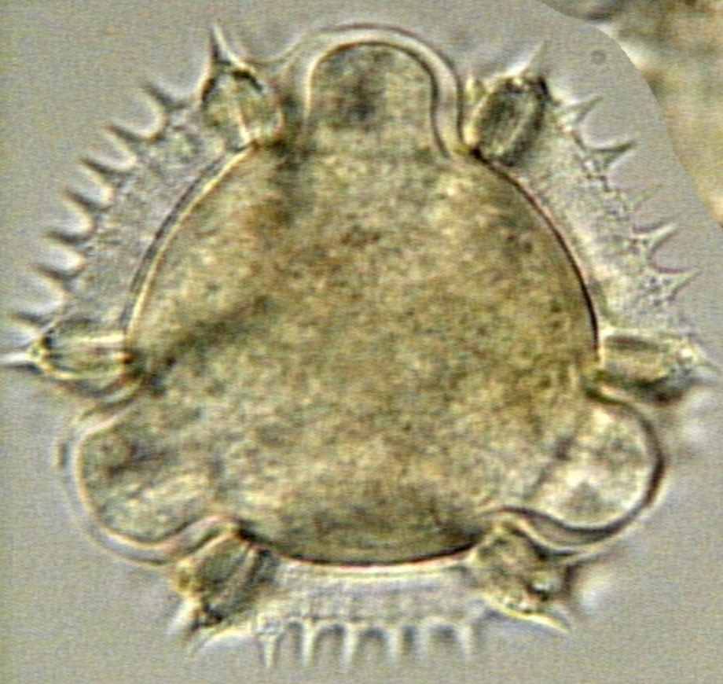

`cichorium_intybus`
cichorium_intybus
38 µm → 95px

`taraxacum_typ`
taraxacum_typ
28 µm → 70px
scale via `taraxacum_officinale`

### #2 `crepis_biennis` ↔ `taraxacum_typ`  **(D · difficult)**

*Δ mid 2.5 µm · fenestraat-taraxacum · fenestraat / letter T (composieten ABCHJST)*

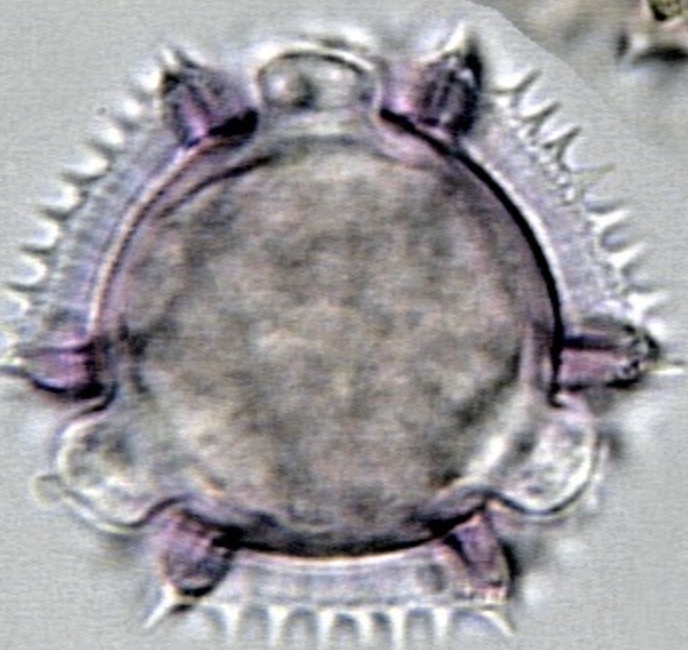

`crepis_biennis`
crepis_biennis
30 µm → 75px

`taraxacum_typ`
taraxacum_typ
28 µm → 70px
scale via `taraxacum_officinale`

### #3 `hieracium_aurantiacum` ↔ `taraxacum_typ`  **(D · difficult)**

*Δ mid 1.0 µm · fenestraat-taraxacum · fenestraat / letter T (composieten ABCHJST)*

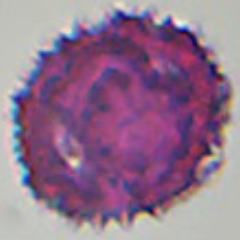

`hieracium_aurantiacum`
hieracium_aurantiacum
30 µm → 75px

`taraxacum_typ`
taraxacum_typ
28 µm → 70px
scale via `taraxacum_officinale`

### #4 `hieracium_typ` ↔ `taraxacum_typ`  **(M · moderate)**

*Δ mid 2.0 µm · fenestraat-taraxacum · fenestraat / letter T (composieten ABCHJST)*

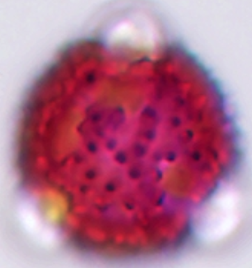

`hieracium_typ`
hieracium_typ
30 µm → 75px
scale via `hieracium_aurantiacum`

`taraxacum_typ`
taraxacum_typ
28 µm → 70px
scale via `taraxacum_officinale`

### #5 `sonchus_arvensis` ↔ `taraxacum_typ`  **(E · easy)**

*Δ mid 14.5 µm · fenestraat-taraxacum · fenestraat / letter T (composieten ABCHJST) · outside ±10 µm*

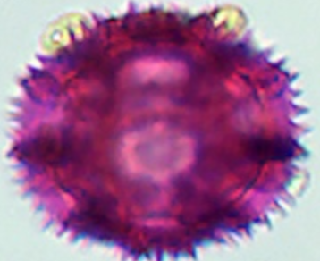

`sonchus_arvensis`
sonchus_arvensis
45 µm → 112px

`taraxacum_typ`
taraxacum_typ
28 µm → 70px
scale via `taraxacum_officinale`

### #6 `taraxacum_typ` ↔ `tragopogon_typ`  **(E · easy)**

*Δ mid 16.0 µm · fenestraat-taraxacum · fenestraat / letter T (composieten ABCHJST) · outside ±10 µm*

`taraxacum_typ`
taraxacum_typ
28 µm → 70px
scale via `taraxacum_officinale`

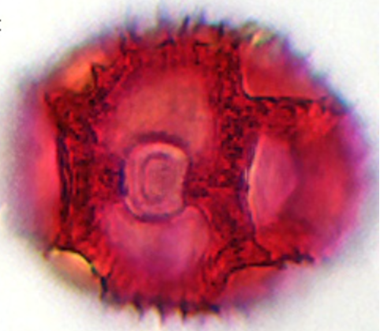

`tragopogon_typ`
tragopogon_typ
55 µm → 138px
scale via `tragopogon_pratensis`

### #7 `brassica_typ` ↔ `fraxinus_ornus`  **(E · easy)**

*Δ mid 3.25 µm · fraxinus-salix-cruciferae*

`brassica_typ`
brassica_typ
28.2 µm → 70px
scale via `brassica_napus`

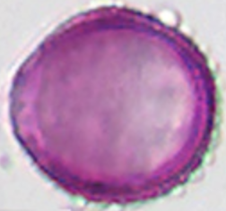

`fraxinus_ornus`
fraxinus_ornus
23 µm → 58px

### #8 `brassica_typ` ↔ `salix_typ`  **(M · moderate)**

*Δ mid 6.75 µm · fraxinus-salix-cruciferae*

`brassica_typ`
brassica_typ
28.2 µm → 70px
scale via `brassica_napus`

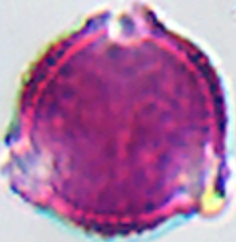

`salix_typ`
salix_typ
28.7 µm → 72px
scale via `salix_alba_var_tristis`

### #9 `fraxinus_ornus` ↔ `salix_typ`  **(U · unrated)**

*Δ mid 3.5 µm · fraxinus-salix-cruciferae*

`fraxinus_ornus`
fraxinus_ornus
23 µm → 58px

`salix_typ`
salix_typ
28.7 µm → 72px
scale via `salix_alba_var_tristis`

### #10 `aesculus_hippocastanum` ↔ `melilotus_officinalis`  **(E · easy)**

*Δ mid 2.0 µm · melilotus-trifolium-repens*

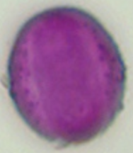

`aesculus_hippocastanum`
aesculus_hippocastanum
24 µm → 60px

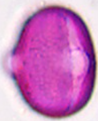

`melilotus_officinalis`
melilotus_officinalis
26 µm → 65px

### #11 `aesculus_hippocastanum` ↔ `trifolium_repens`  **(E · easy)**

*Δ mid 1.0 µm · melilotus-trifolium-repens*

`aesculus_hippocastanum`
aesculus_hippocastanum
24 µm → 60px

`trifolium_repens`
trifolium_repens
25 µm → 62px

### #12 `melilotus_officinalis` ↔ `trifolium_repens`  **(E · easy)**

*Δ mid 3.0 µm · melilotus-trifolium-repens*

`melilotus_officinalis`
melilotus_officinalis
26 µm → 65px

`trifolium_repens`
trifolium_repens
25 µm → 62px

### #13 `malus_typ` ↔ `prunus_pirus_typ`  **(M · moderate)**

*Δ mid 8.25 µm · prunus-pirus-malus · lookalike (Malus / Peer side)*

`malus_typ`
malus_typ
31 µm → 78px
scale via `malus_sylvestris`

`prunus_pirus_typ`
prunus_pirus_typ
39.2 µm → 98px
scale via `prunus_avium`

### #14 `prunus_avium` ↔ `prunus_pirus_typ`  **(D · difficult)**

*Δ mid 0.0 µm · prunus-pirus-malus · lookalike; some views a little larger*

`prunus_avium`
prunus_avium
39.2 µm → 98px

`prunus_pirus_typ`
prunus_pirus_typ
39.2 µm → 98px
scale via `prunus_avium`

### #15 `prunus_laurocerasus` ↔ `prunus_pirus_typ`  **(E · easy)**

*Δ mid 4.25 µm · prunus-pirus-malus · lookalike; a little larger*

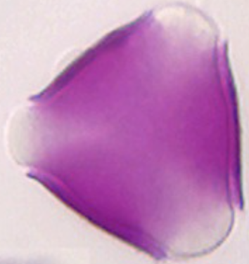

`prunus_laurocerasus`
prunus_laurocerasus
45 µm → 112px

`prunus_pirus_typ`
prunus_pirus_typ
39.2 µm → 98px
scale via `prunus_avium`

### #16 `brassica_typ` ↔ `ligustrum_vulgare`  **(E · easy)**

*Δ mid 3.650000000000002 µm · raphanus-brassica-sinapis-ligustrum*

`brassica_typ`
brassica_typ
28.2 µm → 70px
scale via `brassica_napus`

`ligustrum_vulgare`
ligustrum_vulgare
33.7 µm → 84px

### #17 `brassica_typ` ↔ `raphanus_typ`  **(D · difficult)**

*Δ mid 2.25 µm · raphanus-brassica-sinapis-ligustrum*

`brassica_typ`
brassica_typ
28.2 µm → 70px
scale via `brassica_napus`

`raphanus_typ`
raphanus_typ
23 µm → 58px
scale via `raphanus_raphanistrum`

### #18 `brassica_typ` ↔ `sinapis_typ`  **(M · moderate)**

*Δ mid 7.75 µm · raphanus-brassica-sinapis-ligustrum*

`brassica_typ`
brassica_typ
28.2 µm → 70px
scale via `brassica_napus`

`sinapis_typ`
sinapis_typ
35 µm → 88px
scale via `sinapis_arvensis`

### #19 `ligustrum_vulgare` ↔ `raphanus_typ`  **(E · easy)**

*Δ mid 5.900000000000002 µm · raphanus-brassica-sinapis-ligustrum*

`ligustrum_vulgare`
ligustrum_vulgare
33.7 µm → 84px

`raphanus_typ`
raphanus_typ
23 µm → 58px
scale via `raphanus_raphanistrum`

### #20 `ligustrum_vulgare` ↔ `sinapis_typ`  **(E · easy)**

*Δ mid 4.099999999999998 µm · raphanus-brassica-sinapis-ligustrum*

`ligustrum_vulgare`
ligustrum_vulgare
33.7 µm → 84px

`sinapis_typ`
sinapis_typ
35 µm → 88px
scale via `sinapis_arvensis`

### #21 `raphanus_typ` ↔ `sinapis_typ`  **(E · easy)**

*Δ mid 10.0 µm · raphanus-brassica-sinapis-ligustrum*

`raphanus_typ`
raphanus_typ
23 µm → 58px
scale via `raphanus_raphanistrum`

`sinapis_typ`
sinapis_typ
35 µm → 88px
scale via `sinapis_arvensis`

### #22 `prunus_padus` ↔ `prunus_serotina`  **(U · unrated)**

*Δ mid 2.0 µm · rubus-prunus-vogelkers*

`prunus_padus`
prunus_padus
25 µm → 62px

missing image for prunus_serotina

### #23 `prunus_padus` ↔ `rubus_typ`  **(M · moderate)**

*Δ mid 0.0 µm · rubus-prunus-vogelkers*

`prunus_padus`
prunus_padus
25 µm → 62px

`rubus_typ`
rubus_typ
36.9 µm → 92px
scale via `rubus_fruticosus`

### #24 `prunus_serotina` ↔ `rubus_typ`  **(U · unrated)**

*Δ mid 2.0 µm · rubus-prunus-vogelkers*

missing image for prunus_serotina

`rubus_typ`
rubus_typ
36.9 µm → 92px
scale via `rubus_fruticosus`

### #25 `anthriscus_typ` ↔ `vicia_typ`  **(M · moderate)**

*Δ mid 26.85 µm · umbelliferae-vicia · outside ±10 µm*

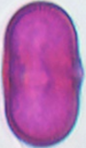

`anthriscus_typ`
anthriscus_typ
27.2 µm → 68px
scale via `anthriscus_sylvestris`

`vicia_typ`
vicia_typ
47 µm → 118px
scale via `vicia_faba`

### #26 `centaurea_cyanus` ↔ `heracleum_typ`  **(E · easy)**

*Δ mid 0.4000000000000057 µm · user: lookalike*

`centaurea_cyanus`
centaurea_cyanus
45.3 µm → 113px

`heracleum_typ`
heracleum_typ
41.6 µm → 104px
scale via `heracleum_sphondylium`

### #27 `centaurea_cyanus` ↔ `trifolium_pratense`  **(E · easy)**

*Δ mid 0.6000000000000085 µm · user: lookalike*

`centaurea_cyanus`
centaurea_cyanus
45.3 µm → 113px

`trifolium_pratense`
trifolium_pratense
41.5 µm → 104px

### #28 `centaurea_cyanus` ↔ `vicia_typ`  **(E · easy)**

*Δ mid 8.900000000000006 µm · user: lookalike*

`centaurea_cyanus`
centaurea_cyanus
45.3 µm → 113px

`vicia_typ`
vicia_typ
47 µm → 118px
scale via `vicia_faba`

### #29 `centaurea_typ` ↔ `ranunculus_typ`  **(E · easy)**

*Δ mid 1.5 µm · user: lookalike*

`centaurea_typ`
centaurea_typ
47 µm → 118px
scale via `centaurea_montana`

`ranunculus_typ`
ranunculus_typ
34.9 µm → 87px
scale via `ranunculus_acris`

### #30 `ranunculus_typ` ↔ `sinapis_typ`  **(M · moderate)**

*Δ mid 1.5 µm · user: lookalike*

`ranunculus_typ`
ranunculus_typ
34.9 µm → 87px
scale via `ranunculus_acris`

`sinapis_typ`
sinapis_typ
35 µm → 88px
scale via `sinapis_arvensis`
