# Lookalike gap review — all remaining

> Reply in chat: per pair `same` / `different` / `unsure`, or e.g. `tilia: different all`, `centaurea_cyanus: 1 same, rest different`.

## Taraxacum typ (fenestraat / letter T) {#taraxacum_typ}

> Only same-letter T / fenestraat partners are candidates. Other echinaat letters already rejected.

### Anchor

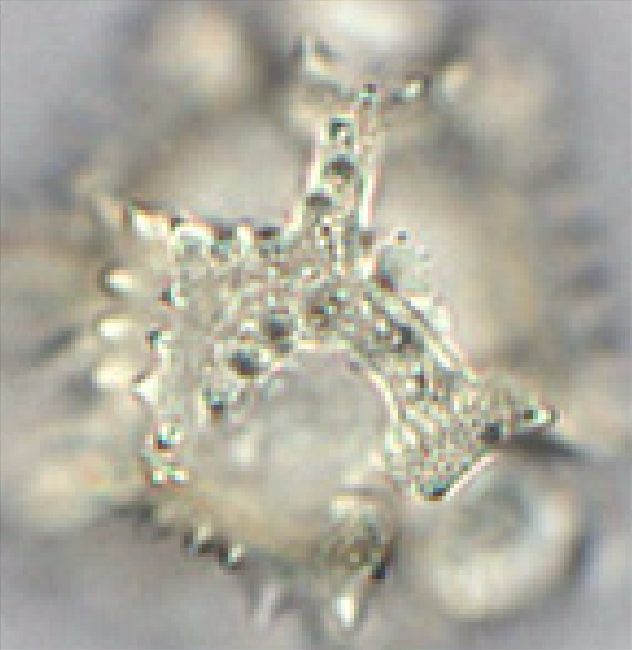

`taraxacum_typ` **[T]**
Taraxacum typ (paardenbloem type)
echinaat t

*No pending partners matching filter.*

## Centaurea cyanus (letter C) {#centaurea_cyanus}

> C-type (no spines). Prefer other C / non-spiny Centaurea; reject fenestraat T and long-spine H/A as default noise unless you say same.

### Anchor

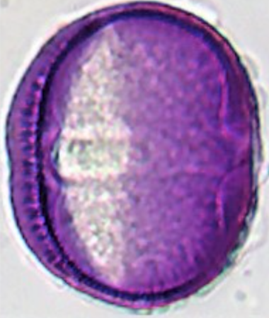

`centaurea_cyanus` **[C]**
Centaurea cyanus (korenbloem)
striaat; volgens paldat lm echinaat

10 candidates:

### #1 `centaurea_cyanus` ↔ `heracleum_typ` · ov [38.1, 38.5] · tricol*

`centaurea_cyanus` **[C]**
Centaurea cyanus (korenbloem)
striaat; volgens paldat lm echinaat

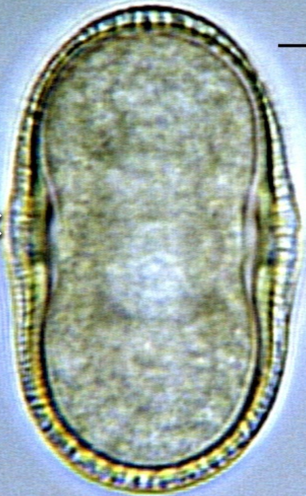

`heracleum_typ`
Heracleum typ (Reuzenkruiskruid type)
verrucaat tot scabraat

### #2 `centaurea_cyanus` ↔ `trifolium_pratense` · ov [38.1, 38.7] · tricol*

`centaurea_cyanus` **[C]**
Centaurea cyanus (korenbloem)
striaat; volgens paldat lm echinaat

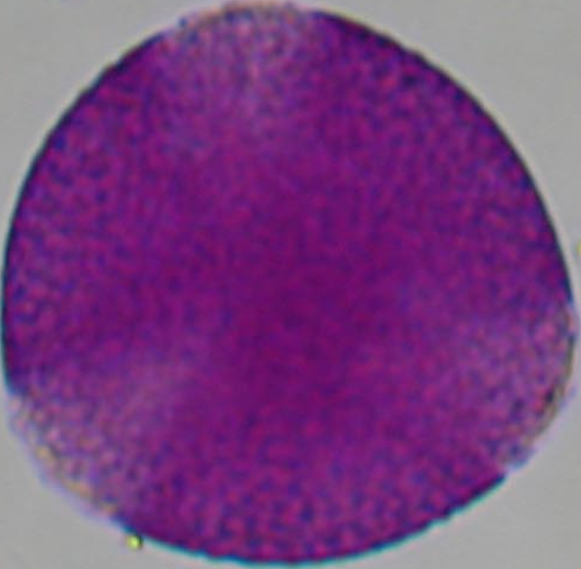

`trifolium_pratense`
Trifolium pratense (rode klaver)
grof reticulaat

### #3 `centaurea_cyanus` ↔ `crataegus_typ` · ov [38.1, 40.0] · tricol*

`centaurea_cyanus` **[C]**
Centaurea cyanus (korenbloem)
striaat; volgens paldat lm echinaat

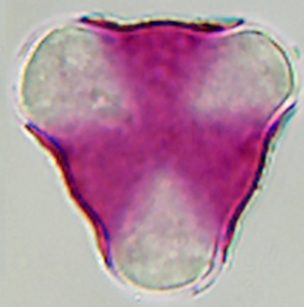

`crataegus_typ`
Crataegus typ (meidoorn type)
onduidelijk striaat

### #4 `centaurea_cyanus` ↔ `calluna_vulgaris` · ov [35.5, 38.1] · tricol*

`centaurea_cyanus` **[C]**
Centaurea cyanus (korenbloem)
striaat; volgens paldat lm echinaat

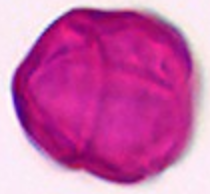

`calluna_vulgaris`
Calluna vulgaris (struikheide)
psilaat

### #5 `centaurea_cyanus` ↔ `helianthus_annuus` · ov [35.0, 38.1] · tricol*

`centaurea_cyanus` **[C]**
Centaurea cyanus (korenbloem)
striaat; volgens paldat lm echinaat

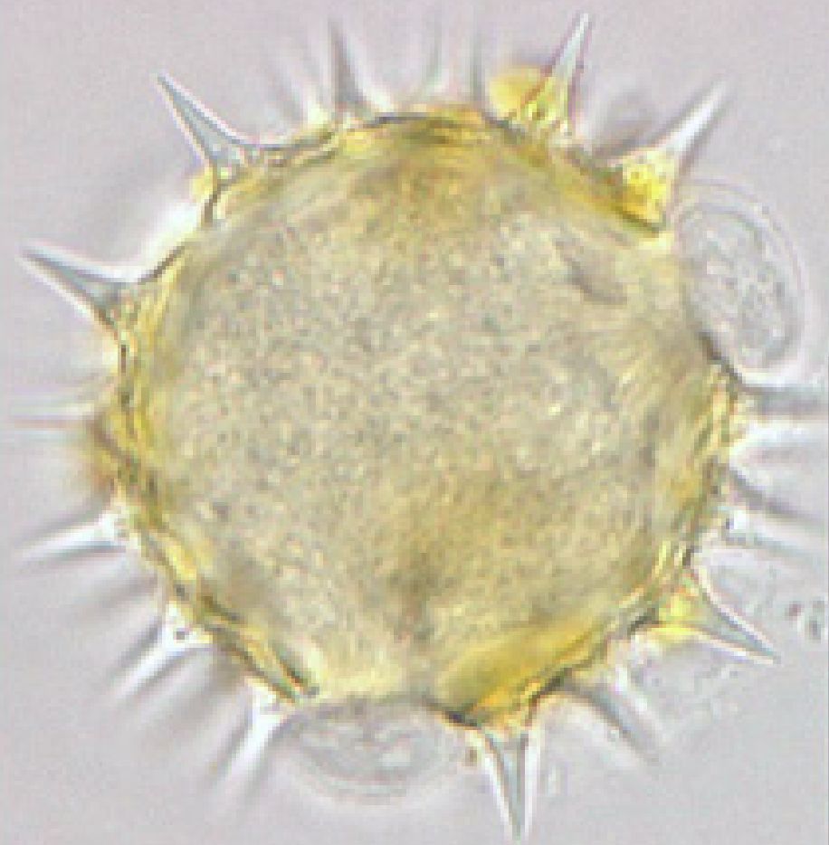

`helianthus_annuus` **[H]**
Helianthus annuus (zonnebloem)
echinaat h

### #6 `centaurea_cyanus` ↔ `helianthus_typ` · ov [35.0, 38.1] · tricol*

`centaurea_cyanus` **[C]**
Centaurea cyanus (korenbloem)
striaat; volgens paldat lm echinaat

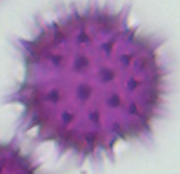

`helianthus_typ` **[H]**
Helianthus typ (zonnebloem type)
echinaat h

### #7 `centaurea_cyanus` ↔ `tilia_typ` · ov [35.0, 38.1] · tricol*

`centaurea_cyanus` **[C]**
Centaurea cyanus (korenbloem)
striaat; volgens paldat lm echinaat

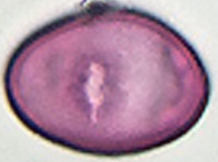

`tilia_typ`
Tilia typ (linde type)
foveolaat

### #8 `centaurea_cyanus` ↔ `ranunculus_typ` · ov [34.5, 38.1] · tricol*

`centaurea_cyanus` **[C]**
Centaurea cyanus (korenbloem)
striaat; volgens paldat lm echinaat

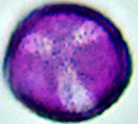

`ranunculus_typ`
Ranunculus typ (Ranonkel type)
verrucaat

### #9 `centaurea_cyanus` ↔ `vicia_typ` · ov [33.8, 38.1] · tricol*

`centaurea_cyanus` **[C]**
Centaurea cyanus (korenbloem)
striaat; volgens paldat lm echinaat

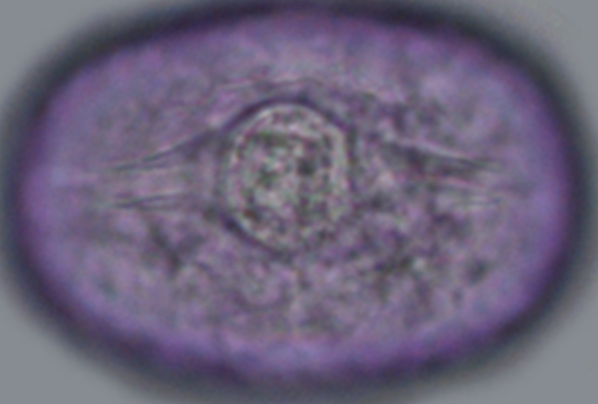

`vicia_typ`
Vicia typ (Wikke type)
reticulaat

### #10 `centaurea_cyanus` ↔ `acer_platanoides` · ov [33.1, 38.1] · tricol*

`centaurea_cyanus` **[C]**
Centaurea cyanus (korenbloem)
striaat; volgens paldat lm echinaat

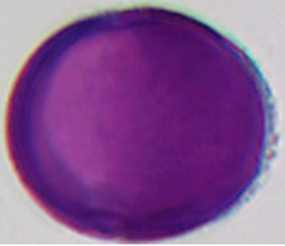

`acer_platanoides`
Acer platanoides (Noorse esdoorn)
striaat

## Tilia typ {#tilia_typ}

> Reticulate/foveolate tricolporate; compare size-near partners with images.

### Anchor

`tilia_typ`
Tilia typ (linde type)
foveolaat

10 candidates:

### #1 `tilia_typ` ↔ `helianthus_annuus` · ov [35.0, 35.0] · tricol*

`tilia_typ`
Tilia typ (linde type)
foveolaat

`helianthus_annuus` **[H]**
Helianthus annuus (zonnebloem)
echinaat h

### #2 `tilia_typ` ↔ `helianthus_typ` · ov [35.0, 35.0] · tricol*

`tilia_typ`
Tilia typ (linde type)
foveolaat

`helianthus_typ` **[H]**
Helianthus typ (zonnebloem type)
echinaat h

### #3 `tilia_typ` ↔ `calluna_vulgaris` · ov [35.0, 35.5] · tricol*

`tilia_typ`
Tilia typ (linde type)
foveolaat

`calluna_vulgaris`
Calluna vulgaris (struikheide)
psilaat

### #4 `tilia_typ` ↔ `ranunculus_typ` · ov [34.5, 35.0] · tricol*

`tilia_typ`
Tilia typ (linde type)
foveolaat

`ranunculus_typ`
Ranunculus typ (Ranonkel type)
verrucaat

### #5 `tilia_typ` ↔ `vicia_typ` · ov [33.8, 35.0] · tricol*

`tilia_typ`
Tilia typ (linde type)
foveolaat

`vicia_typ`
Vicia typ (Wikke type)
reticulaat

### #6 `tilia_typ` ↔ `acer_platanoides` · ov [33.1, 35.0] · tricol*

`tilia_typ`
Tilia typ (linde type)
foveolaat

`acer_platanoides`
Acer platanoides (Noorse esdoorn)
striaat

### #7 `tilia_typ` ↔ `centaurea_jacea` · ov [33.0, 35.0] · tricol*

`tilia_typ`
Tilia typ (linde type)
foveolaat

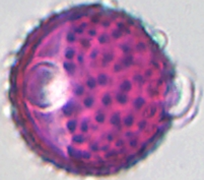

`centaurea_jacea` **[J]**
Centaurea jacea (knoopkruid)
echinaat j

### #8 `tilia_typ` ↔ `centaurea_typ` · ov [33.0, 35.0] · tricol*

`tilia_typ`
Tilia typ (linde type)
foveolaat

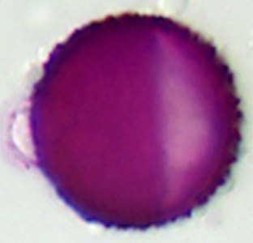

`centaurea_typ` **[J]**
Centaurea typ (Centaurea type)
echinaat j

### #9 `tilia_typ` ↔ `sinapis_typ` · ov [33.0, 35.0] · tricol*

`tilia_typ`
Tilia typ (linde type)
foveolaat

`sinapis_typ`
Sinapis typ (Mosterd type)
reticulaat

### #10 `tilia_typ` ↔ `achillea_typ` · ov [32.0, 35.0] · tricol*

`tilia_typ`
Tilia typ (linde type)
foveolaat

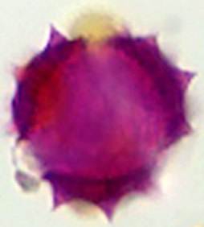

`achillea_typ` **[A]**
Achillea typ (Duizendblad type)
echinaat; echini ca. 3.3 µm; exine ca. 3 µm dik

## Ranunculus typ {#ranunculus_typ}

> Verrucaat / scabraat tricolpate; compare size-near partners.

### Anchor

`ranunculus_typ`
Ranunculus typ (Ranonkel type)
verrucaat

10 candidates:

### #1 `ranunculus_typ` ↔ `helianthus_annuus` · ov [34.5, 35.0] · tricol*

`ranunculus_typ`
Ranunculus typ (Ranonkel type)
verrucaat

`helianthus_annuus` **[H]**
Helianthus annuus (zonnebloem)
echinaat h

### #2 `ranunculus_typ` ↔ `helianthus_typ` · ov [34.5, 35.0] · tricol*

`ranunculus_typ`
Ranunculus typ (Ranonkel type)
verrucaat

`helianthus_typ` **[H]**
Helianthus typ (zonnebloem type)
echinaat h

### #3 `ranunculus_typ` ↔ `tilia_typ` · ov [34.5, 35.0] · tricol*

`ranunculus_typ`
Ranunculus typ (Ranonkel type)
verrucaat

`tilia_typ`
Tilia typ (linde type)
foveolaat

### #4 `ranunculus_typ` ↔ `vicia_typ` · ov [33.8, 34.5] · tricol*

`ranunculus_typ`
Ranunculus typ (Ranonkel type)
verrucaat

`vicia_typ`
Vicia typ (Wikke type)
reticulaat

### #5 `ranunculus_typ` ↔ `calluna_vulgaris` · ov [34.5, 35.5] · tricol*

`ranunculus_typ`
Ranunculus typ (Ranonkel type)
verrucaat

`calluna_vulgaris`
Calluna vulgaris (struikheide)
psilaat

### #6 `ranunculus_typ` ↔ `acer_platanoides` · ov [33.1, 34.5] · tricol*

`ranunculus_typ`
Ranunculus typ (Ranonkel type)
verrucaat

`acer_platanoides`
Acer platanoides (Noorse esdoorn)
striaat

### #7 `ranunculus_typ` ↔ `centaurea_jacea` · ov [33.0, 34.5] · tricol*

`ranunculus_typ`
Ranunculus typ (Ranonkel type)
verrucaat

`centaurea_jacea` **[J]**
Centaurea jacea (knoopkruid)
echinaat j

### #8 `ranunculus_typ` ↔ `centaurea_typ` · ov [33.0, 34.5] · tricol*

`ranunculus_typ`
Ranunculus typ (Ranonkel type)
verrucaat

`centaurea_typ` **[J]**
Centaurea typ (Centaurea type)
echinaat j

### #9 `ranunculus_typ` ↔ `sinapis_typ` · ov [33.0, 34.5] · tricol*

`ranunculus_typ`
Ranunculus typ (Ranonkel type)
verrucaat

`sinapis_typ`
Sinapis typ (Mosterd type)
reticulaat

### #10 `ranunculus_typ` ↔ `achillea_typ` · ov [32.0, 34.5] · tricol*

`ranunculus_typ`
Ranunculus typ (Ranonkel type)
verrucaat

`achillea_typ` **[A]**
Achillea typ (Duizendblad type)
echinaat; echini ca. 3.3 µm; exine ca. 3 µm dik
