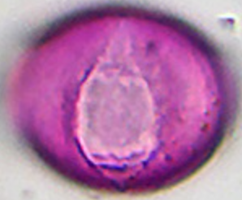
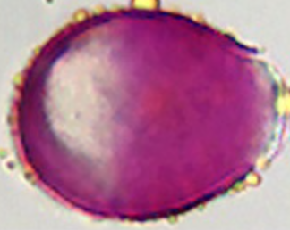
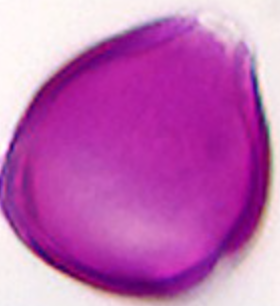
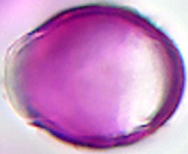

# Pruim/Peer lookalikes — corrected true scale

> **Warning:** Previous HTML was wrong: `prunus_pirus_typ` had empty size → default 50 µm = 125 px while showing an *avium* photo (~39 µm = 98 px).

> Rule: `width_px = round(largest_µm × 2.5)`, taken from the **image folder taxon**, not the label slug.

`prunus_pirus_typ`
Prunus pirus (Pruim/Peer type) *(type face = avium_2)*
37.3 µm–39.2 µm → 98px

`prunus_avium`
Prunus avium (zoete kers)
37.3 µm–39.2 µm → 98px

`prunus_laurocerasus`
Prunus laurocerasus (laurierkers) *(a little larger)*
40 µm–45 µm → 112px

`malus_typ`
Malus typ (appel type)
30 µm → 75px
