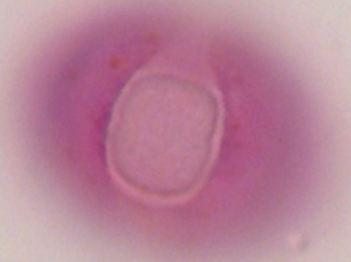
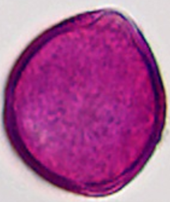
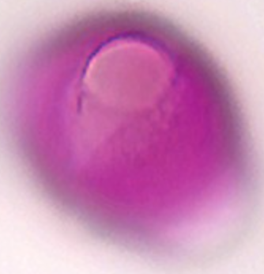
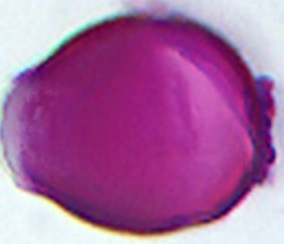

# Choose representative for `prunus_pirus_typ` (Pruim/Peer type)

> **Warning:** #4 `prunus_padus` is not a lookalike: the type currently reuses the same `prunus_padus_1.png` as its first image.

> Type has empty morphology in YAML; images are borrowed from several *Prunus* species.
Pick which image(s) should represent the type for lookalike review (e.g. `rep: R3` or `rep: R5 R6`).
Then we can redo lookalike pairs against Malus / Rubus / Robinia / etc. using that face.

Images currently listed on the type (+ optional Malus for “Peer”):

**R1** `prunus_padus`
Prunus padus (vogelkers)
assets/images/by-taxon/prunus_padus/prunus_padus_1.png

**R2** `prunus_spinosa`
Prunus spinosa (sleedoorn)
assets/images/by-taxon/prunus_spinosa/prunus_spinosa_1.png

**R3** `prunus_padus`
Prunus padus (vogelkers)
assets/images/by-taxon/prunus_padus/prunus_padus_2.png

**R4** `prunus_spinoza`
Prunus spinosa (sleedoorn)
assets/images/by-taxon/prunus_spinoza/prunus_spinoza_1.png

**R5** `prunus_laurocerasus`
Prunus laurocerasus (laurierkers)
assets/images/by-taxon/prunus_laurocerasus/prunus_laurocerasus_1.png

**R6** `prunus_avium`
Prunus avium (zoete kers)
assets/images/by-taxon/prunus_avium/prunus_avium_1.png

**R7** `prunus_laurocerasus`
Prunus laurocerasus (laurierkers)
assets/images/by-taxon/prunus_laurocerasus/prunus_laurocerasus_2.png

**R8** `prunus_avium`
Prunus avium (zoete kers)
assets/images/by-taxon/prunus_avium/prunus_avium_2.png

**R9** `malus_domestica`
Malus domestica (appel)
assets/images/by-taxon/malus_domestica/malus_domestica_1.png

**R10** `malus_sylvestris`
Malus sylvestris (wilde appel)
assets/images/by-taxon/malus_sylvestris/malus_sylvestris_1.png
