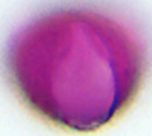
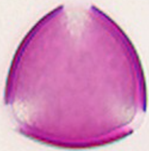
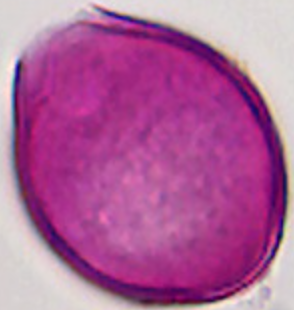
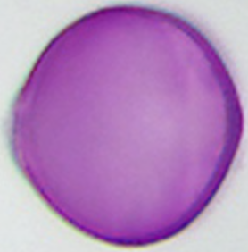
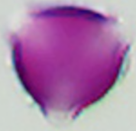

# Batch: `prunus_pirus_typ` without Acer

> Acer rejected earlier. Reply: `1 same, 3 same, rest different`

Anchor: 25 µm; tricolporaat; glad/zw.striaat

### #1 `prunus_pirus_typ` ↔ `malus_typ`

*former acer-cluster member without Acer · partner: 30 µm; 3-colp(or)aat; glad/rugulaat*

`prunus_pirus_typ`
Prunus pirus (Pruim/Peer type)

`malus_typ`
Malus typ (appel type)

### #2 `prunus_pirus_typ` ↔ `robinia_pseudoacacia`

*former acer-cluster member without Acer · partner: 30 µm; tricolpaat; colpi aan de rand uitgefranst; scabraat*

`prunus_pirus_typ`
Prunus pirus (Pruim/Peer type)

`robinia_pseudoacacia`
Robinia pseudoacacia (valse acacia)

### #3 `prunus_pirus_typ` ↔ `rubus_typ`

*already lookalike with P. padus; check vs Prunus/Peer type · partner: 25 µm; 3-colporaat; glad/striaat*

`prunus_pirus_typ`
Prunus pirus (Pruim/Peer type)

`rubus_typ`
Rubus typ (braam/framboos type)

### #4 `prunus_pirus_typ` ↔ `prunus_padus`

*within Prunus / type aggregate · partner: 25 µm; tricolporaat; glad/zw.striaat*

`prunus_pirus_typ`
Prunus pirus (Pruim/Peer type)

`prunus_padus`
Prunus padus (vogelkers)

### #5 `prunus_pirus_typ` ↔ `prunus_avium`

*within Prunus · partner: 37.3 µm–39.2 µm; tricolporaat; porendiameter dwars ca. 13,4 µm; striaat tot rugulaat*

`prunus_pirus_typ`
Prunus pirus (Pruim/Peer type)

`prunus_avium`
Prunus avium (zoete kers)

### #6 `prunus_pirus_typ` ↔ `prunus_spinosa`

*within Prunus · partner: 39.1 µm–42.6 µm; tricolporoïd; striaat*

`prunus_pirus_typ`
Prunus pirus (Pruim/Peer type)

`prunus_spinosa`
Prunus spinosa (sleedoorn)

### #7 `prunus_pirus_typ` ↔ `rosa_canina`

*Rosaceae tricolporate striate? · partner: 30.4 µm–36.4 µm; tricolporaat; apertuurmembranen mittig korrelig geornamenteerd; striaat*

`prunus_pirus_typ`
Prunus pirus (Pruim/Peer type)

`rosa_canina`
Rosa canina (hondsroos)

### #8 `prunus_pirus_typ` ↔ `crataegus_typ`

*Rosaceae · partner: 40 µm; 3-colporaat; onduidelijk striaat*

`prunus_pirus_typ`
Prunus pirus (Pruim/Peer type)

`crataegus_typ`
Crataegus typ (meidoorn type)

### #9 `prunus_pirus_typ` ↔ `spiraea_typ`

*Rosaceae small · partner: 12 µm–16 µm; —; glad*

`prunus_pirus_typ`
Prunus pirus (Pruim/Peer type)

`spiraea_typ`
Spiraea typ (spirea type)
