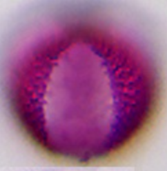

# Lookalike review (local)

> Updated after your feedback. Acer cluster removed (not lookalike).

> **Rejected:** acer-prunus-pyrus — shapes differ under LM.

## Confirmed (your yes)

## Rubus / Prunus serotina / P. padus {#rubus-prunus-vogelkers}

`rubus_typ`
Rubus typ (braam/framboos type)

`prunus_padus`
Prunus padus (vogelkers)

- Prunus serotina (Am. vogelkers) — no image

## Trifolium repens / Melilotus / Aesculus {#melilotus-trifolium-repens}

`trifolium_repens`
Trifolium repens (witte klaver)

`melilotus_officinalis`
Melilotus officinalis (citroengele honingklaver)

`aesculus_hippocastanum`
Aesculus hippocastanum (paardenkastanje)

## Raphanus / Brassica / Sinapis / Ligustrum {#raphanus-brassica-sinapis-ligustrum}

`raphanus_typ`
Raphanus typ (Radijs type)

`brassica_typ`
Brassica typ (kool type)

`sinapis_typ`
Sinapis typ (Mosterd type)

`ligustrum_vulgare`
Ligustrum vulgare (liguster)

## Fraxinus / Salix / Cruciferae {#fraxinus-salix-cruciferae}

`salix_typ`
Salix typ (wilg type)

`fraxinus_ornus`
Fraxinus ornus (es)

`brassica_typ`
Brassica typ (kool type)

## Umbelliferae / Vicia {#umbelliferae-vicia}

`anthriscus_typ`
Anthriscus typ (Berenklauw type)

`vicia_typ`
Vicia typ (Wikke type)

## Taraxacum: same letter (T) only

Different letters (A/H/J/C) marked *different*. Same-letter T partners: none else in Level-2 shortlist yet.

`taraxacum_typ`
Taraxacum typ (paardenbloem type)
